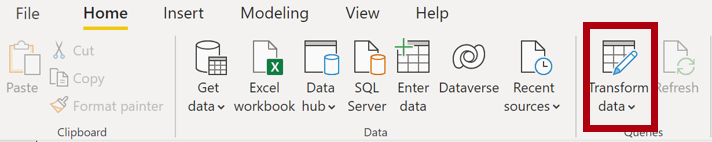
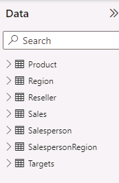

---
lab:
    title: 'Load Data in Power BI Desktop'
    module: 'Module 3 - Clean, Transform, and Load Data in Power BI'
---

# **Load Data in Power BI Desktop**

**The estimated time to complete the lab is 45 minutes**

In this lab you will commence apply transformations to each of the queries created in the previous lab. You will then apply the queries to load each as a table to the data model.

In this lab you learn how to:

- Apply various transformations

- Apply queries to load them to the data model

### **Lab story**

This lab is one of many in a series of labs that was designed as a complete story from data preparation to publication as reports and dashboards. You can complete the labs in any order. However, if you intend to work through multiple labs, for the first 10 labs, we suggest you do them in the following order:

1. Prepare Data in Power BI Desktop

2. **Load Data in Power BI Desktop**

3. Model Data in Power BI Desktop, Part 1

4. Model Data in Power BI Desktop, Part 2

5. Create DAX Calculations in Power BI Desktop, Part 1

6. Create DAX Calculations in Power BI Desktop, Part 2

7. Design a Report in Power BI Desktop, Part 1

8. Design a Report in Power BI Desktop, Part 2

9. Create a Power BI Dashboard

10. Create a Power BI Paginated Report

11. Perform Data Analysis in Power BI Desktop

12. Enforce Row-Level Security

## **Exercise 1: Load Data**

In this exercise you will apply transformations to each of the queries created in the previous lab.

### **Task 1: Get started**

In this task you will setup the environment for the lab.

*Important: If you are continuing on from the previous lab (and you completed that lab successfully), do not complete this task; instead, continue from the next task.*

1. To open the Power BI Desktop, on the taskbar, click the Microsoft Power BI Desktop shortcut.

    

1. To close the getting started window, at the top-left of the window, click **X**.

    

1. To open the starter Power BI Desktop file, click the **File** ribbon tab to open the backstage view.

1. Select **Open Report**.

	

1. Click **Browse Reports**.

    

1. In the **Open** window, navigate to the **D:\DA100\Labs\02-load-data-with-power-query-in-power-bi-desktop\Starter** folder.

1. Select the **Sales Analysis** file.

1. Click **Open**.

	

1. Close any informational windows that may open.

1. Notice the yellow warning message beneath the ribbon.

	*The message alerts you to the fact that the queries have not been applied to load as model tables. You’ll apply the queries later in this lab.*

1. To dismiss the warning message, at the right of the yellow warning message, click **X**.

	

1. To create a copy of the file, click the **File** ribbon tab to open the backstage view.

1. Select **Save As**.

    

1. If prompted to apply changes, click **Apply Later**.

    

1. In the **Save As** window, navigate to the **D:\DA100\MySolution** folder.

1. Click **Save**.

    

1. To open the **Power Query Editor** window, on the **Home** ribbon tab, from inside the **Queries** group, click the **Transform Data** icon.

	

### **Task 2: Configure the Salesperson query**

In this task you will configure the **Salesperson** query.

1. In the **Power Query Editor** window, in the **Queries** pane, select the **DimEmployee** query.

	

2. To rename the query, in the **Query Settings** pane (located at the right), in the **Name** box, replace the text with **Salesperson**, and then press **Enter**.

	*The query name will determine the model table name. It’s recommended to define concise, yet friendly, names.*

3. In the **Queries** pane, verify that the query name has updated.

	

	*You’ll now filter the query rows to retrieve only employees who are salespeople.*

4. To locate a specific column, on the **Home** ribbon tab, from inside the **Manage Columns** group, click the **Choose Columns** down-arrow, and then select **Go to Column**.

	

	*Tip: This technique is useful when a query contains many columns. If there’s not too many columns, you can simply horizontally scroll to locate the column of interest.*

5. In the **Go to Column** window, to order the list by column name, click the **AZ** sort button, and then select **Name**.

	

6. Select the **SalesPersonFlag** column, and then click **OK**.

7. To filter the query, in the **SalesPersonFlag** column header, click the down-arrow, and then uncheck **FALSE**.

	

8. Click **OK**.

	

9. In the **Query Settings** pane, in the **Applied Steps** list, notice the addition of the **Filtered Rows** step.

	

	*Each transformation you create results in additional step logic. It’s possible to edit or delete steps. It’s also possible to select a step to preview the query results at that stage of the query transformation.*

10. To remove columns, on the **Home** ribbon tab, from inside the **Manage Columns** group, click the **Choose Columns** icon.

	

11. In the **Choose Columns** window, to uncheck all columns, uncheck the **(Select All Columns)** item.

	

12. To include columns, check the following six columns:

	- EmployeeKey

	- EmployeeNationalIDAlternateKey

	- FirstName

	- LastName

	- Title

	- EmailAddress

13. Click **OK**.

	

14. In the **Applied Steps** list, notice the addition of another query step.

	

15. To create a single name column, first select the **FirstName** column header.

16. While pressing the **Ctrl** key, select the **LastName** column.

	

17. Right-click either of the select column headers, and then in the context menu, select **Merge Columns**.

	

	*Many common transformations can be applied by right-clicking the column header, and then choosing them from the context menu. Note, however, more transformations are available in the ribbon.*

18. In the **Merge Columns** window, in the **Separator** dropdown list, select **Space**.

19. In the **New Column Name** box, replace the text with **Salesperson**.

	

20. Click **OK**.

	

21. To rename the **EmployeeNationalIDAlternateKey** column, double-click the **EmployeeNationalIDAlternateKey** column header.

22. Replace the text with **EmployeeID**, and then press **Enter**.

	*Important: When instructed to rename columns, it’s important that you rename them exactly as described.*

23. Use the previous steps to rename the **EmailAddress** column to **UPN**.

	*UPN is an acronym for User Principal Name. The values in this column will be used when you configure row-level security in the **Model Data in Power BI Desktop, Part 2** lab.*

24. At the bottom-left, in the status bar, verify that the query has five columns and 18 rows.

	

	*Important: It’s important that you do not proceed if your query does not produce the correct result—it won’t be possible to complete later labs. If the query columns or rows don’t match, refer back to the steps in this task to fix any problems.*

### **Task 3: Configure the SalespersonRegion query**

In this task you will configure the **SalespersonRegion** query.

1. In the **Queries** pane, select the **DimEmployeeSalesTerritory** query.

	

2. In the **Query Settings** pane, rename the query to **SalespersonRegion**.

3. To remove the last two columns, first select the **DimEmployee** column header.

4. While pressing the **Ctrl** key, select the **DimSalesTerritory** column header.

5. Right-click either of the select column headers, and then in the context menu, select **Remove Columns**.

	

6. In the status bar, verify that the query has two columns and 39 rows.

	

### **Task 4: Configure the Product query**

In this task you will configure the **Product** query.

*Important: When detailed instructions have already been provided, the lab steps will now provide more concise instructions. If you need the detailed instructions, you can refer back to the steps of previous tasks.*

1. Select the **DimProduct** query.

	

2. Rename the query to **Product**.

3. Locate the **FinishedGoodsFlag** column, and then filter the column to retrieve products that are finished goods (i.e. TRUE).

4. Remove all columns, except the following:

	- ProductKey

	- EnglishProductName

	- StandardCost

	- Color

	- DimProductSubcategory

5. Notice that the **DimProductSubcategory** column represents a related table (it contains **Value** links).

6. In the **DimProductSubcategory** column header, at the right of the column name, click the expand button.

	

7. To uncheck all columns, uncheck the **(Select All Columns)** item.

8. Check the **EnglishProductSubcategoryName** and **DimProductCategory** columns.

	

	*By selecting these two columns, a transformation will be applied to join to the **DimProductSubcategory** table, and then include these columns. The **DimProductCategory** column is, in fact, another related table in the data source.*

9. Uncheck the **Use Original Column Name as Prefix** checkbox.

	

	*Query column names must always be unique. If left checked, this checkbox would prefix each column with the expanded column name (in this case **DimProductSubcategory**). Because it’s known that the selected column names don’t collide with column names in the **Product** query, the option is deselected.*

10. Click **OK**.

	

11. Notice that the transformation resulted in the addition of two columns, and that the **DimProductSubcategory** column has been removed.

12. Expand the **DimProductCategory** column, and then introduce only the **EnglishProductCategoryName** column.

13. Rename the following four columns:

	- **EnglishProductName** to **Product**

	- **StandardCost** to **Standard Cost** (include a space)

	- **EnglishProductSubcategoryName** to **Subcategory**

	- **EnglishProductCategoryName** to **Category**

14. In the status bar, verify that the query has six columns and 397 rows.

	

### **Task 5: Configure the Reseller query**

In this task you will configure the **Reseller** query.

1. Select the **DimReseller** query.

	

2. Rename the query to **Reseller**.

3. Remove all columns, except the following:

	- ResellerKey

	- BusinessType

	- ResellerName

	- DimGeography

4. Expand the **DimGeography** column, to include only the following three columns:

	- City

	- StateProvinceName

	- EnglishCountryRegionName

	

5. In the **Business Type** column header, click the down-arrow, and then review the distinct column values, and notice the incorrect spelling of warehouse.

	

  
‎ 

6. Right-click the **Business Type** column header, and then select **Replace Values**.

	

7. In the **Replace Values** window, configure the following values:

	- In the **Value to Find** box, enter **Ware House**

	- In the **Replace With** box, enter **Warehouse**

	

8. Click **OK**.

	

9. Rename the following four columns:

	- **BusinessType** to **Business Type** (include a space)

	- **ResellerName** to **Reseller**

	- **StateProvinceName** to **State-Province**

	- **EnglishCountryRegionName** to **Country-Region**

10. In the status bar, verify that the query has six columns and 701 rows.

	

### **Task 6: Configure the Region query**

In this task you will configure the **Region** query.

1. Select the **DimSalesTerritory** query.

	

2. Rename the query to **Region**.

3. Apply a filter to the **SalesTerritoryAlternateKey** column to remove the value 0 (zero).

	

4. Remove all columns, except the following:

	- SalesTerritoryKey

	- SalesTerritoryRegion

	- SalesTerritoryCountry

	- SalesTerritoryGroup

5. Rename the following three columns:

	- **SalesTerritoryRegion** to **Region**

	- **SalesTerritoryCountry** to **Country**

	- **SalesTerritoryGroup** to **Group**

6. In the status bar, verify that the query has four columns and 10 rows.

	

### **Task 7: Configure the Sales query**

In this task you will configure the **Sales** query.

1. Select the **FactResellerSales** query.

	

2. Rename the query to **Sales**.

3. Remove all columns, except the following:

	- SalesOrderNumber

	- OrderDate

	- ProductKey

	- ResellerKey

	- EmployeeKey

	- SalesTerritoryKey

	- OrderQuantity

	- UnitPrice

	- TotalProductCost

	- SalesAmount

	- DimProduct

	*You may recall in the **Prepare Data in Power BI Desktop** lab that a small percentage of **FactResellerSales** rows had missing **TotalProductCost** values. The **DimProduct** column has been included to retrieve the product standard cost column to assist fixing the missing values.*

4. Expand the **DimProduct** column, uncheck all columns, and then include only the **StandardCost** column.

5. To create a custom column, on the **Add Column** ribbon tab, from inside the **General** group, click **Custom Column**.

	

6. In the **Custom Column** window, in the **New Column Name** box, replace the text with **Cost**.

	

7. In the **Custom Column Formula** box, enter the following expression (after the equals symbol):

8. For your convenience, you can copy the expression from the **D:\DA100\Labs\02-load-data-with-power-query-in-power-bi-desktop\Assets\Snippets.txt** file.


   **Power Query**
   ```
   if [TotalProductCost] = null then [OrderQuantity] * [StandardCost] else [TotalProductCost]
   ```


*This expression tests if the **TotalProductCost** value is missing. If it is, produces a value by multiplying the **OrderQuantity** value by the **StandardCost** value; otherwise, it uses the existing **TotalProductCost** value.*

9. Click **OK**.

	

10. Remove the following two columns:

	- TotalProductCost

	- StandardCost

11. Rename the following three columns:

	- **OrderQuantity** to **Quantity**

	- **UnitPrice** to **Unit Price** (include a space)

	- **SalesAmount** to **Sales**

12. To modify the column data type, in the **Quantity** column header, at the left of the column name, click the **1.2** icon, and then select **Whole Number**.

	

	*Configuring the correct data type is important. When the column contains numeric value, it’s also important to choose the correct type if you expect to perform mathematic calculations.*

13. Modify the following three column data types to **Fixed Decimal Number**.

	- Unit Price

	- Sales

	- Cost

	

	*The fixed decimal number data type stores values with full precision, and so requires more storage space that decimal number. It’s important to use the fixed decimal number type for financial values, or rates (like exchange rates).*

14. In the status bar, verify that the query has 10 columns and 999+ rows.

	

	*A maximum of 1000 rows will be loaded as preview data for each query.*

### **Task 8: Configure the Targets query**

In this task you will configure the **Targets** query.

1. Select the **ResellerSalesTargets** query.

	

2. Rename the query to **Targets**.

3. To unpivot the 12 month columns (**M01**-**M12**), first multi-select the **Year** and **EmployeeID** column headers.

	

4. Right-click either of the select column headers, and then in the context menu, select **Unpivot Other Columns**.

	

5. Notice that the column names now appear in the **Attribute** column, and the values appear in the **Value** column.

6. Apply a filter to the **Value** column to remove hyphen (-) values.

	*You may recall that the hyphen character was used in the source CSV file to represent zero (0).*

7. Rename the following two columns:

	- **Attribute** to **MonthNumber** (there is no space between the two words—it will be removed later)

	- **Value** to **Target**

	*You’ll now apply transformations to produce a date column. The date will be derived from the **Year** and **MonthNumber** columns. You’ll create the column by using the **Columns From Examples** feature.*

8. To prepare the **MonthNumber** column values, right-click the **MonthNumber** column header, and then select **Replace Values**.

	

9. In the **Replace Values** window, in the **Value To Find** box, enter **M**.

	

10. Click **OK**.

11. Modify the **MonthNumber** column data type to **Whole Number**.

	

12. On the **Add Column** ribbon tab, from inside the **General** group, click The **Column From Examples** icon.

	

13. Notice that the first row is for year **2017** and month number **7**.

14. In the **Column1** column, in the first grid cell, commence entering **7/1/2017**, and then press **Enter**.

	*The virtual machine uses US regional settings, so this date is in fact July 1, 2017.*

15. Notice that the grid cells update with predicted values.

	*The feature has accurately predicted that you are combining values from the **Year** and **MonthNumber** columns.*

16. Notice also the formula presented above the query grid.

	

17. To rename the new column, double-click the **Merged** column header.

18. Rename the column as **TargetMonth**.

	

19. To add the new column, click **OK**.

	

20. Remove the following columns:

	- Year

	- MonthNumber

21. Modify the following column data types:

	- **Target** as fixed decimal number

	- **TargetMonth** as date

22. To multiply the **Target** values by 1000, select the **Target** column header, and then on the **Transform** ribbon tab, from inside the **Number Column** group, click **Standard**, and then select **Multiply**.

	*You may recall that the target values were stored as thousands.*

	

23. In the **Multiply** window, in the **Value** box, enter **1000**.

	

24. Click **OK**.

	

25. In the status bar, verify that the query has three columns and 809 rows.

	

### **Task 9: Configure the ColorFormats query**

In this task you will configure the **ColorFormats** query.

1. Select the **ColorFormats** query.

	

2. Notice that the first row contains the column names.

3. On the **Home** ribbon tab, from inside the **Transform** group, click **Use First Row as Headers**.

	

4. In the status bar, verify that the query has three columns and 10 rows.

	

### **Task 10: Update the Product query**

In this task you will update the **Product** query by merging the **ColorFormats** query.

1. Select the **Product** query.

	

2. To merge the **ColorFormats** query, on the **Home** ribbon tab, from inside the **Combine** group, click **Merge Queries**.

	

	*Merging queries allows integrating data, in this case from different data sources (SQL Server and a CSV file).*

3. In the **Merge** window, in the **Product** query grid, select the **Color** column header.

	

4. Beneath the **Product** query grid, in the dropdown list, select the **ColorFormats** query.

	

5. In the **ColorFormats** query grid, select the **Color** column header.

6. When the **Privacy Levels** window opens, for each of the two data sources, in the corresponding dropdown list, select **Organizational**.

	

	*Privacy levels can be configured for data source to determine whether data can be shared between sources. Setting each data source as **Organizational** allows them to share data, if necessary. Note that Private data sources can never be shared with other data sources. It doesn’t mean that Private data cannot be shared; it means that the Power Query engine cannot share data between the sources.*

7. Click **Save**.

	

8. In the **Merge** window, use the default **Join Kind** - maintaining the selection of Left Outer and click **OK**.

	

9. Expand the **ColorFormats** column to include the following two columns:

	- Background Color Format

	- Font Color Format

	

10. In the status bar, verify that the query now has eight columns and 397 rows.

	

### **Task 11: Update the ColorFormats query**

In this task you will update the **ColorFormats** to disable its load.

1. Select the **ColorFormats** query.

	

2. In the **Query Settings** pane, click the **All Properties** link.

	

3. In the **Query Properties** window, uncheck the **Enable Load To Report** checkbox.

	

	Disabling the load means it will not load as a table to the data model. This is done because the query was merged with the **Product** query, which is enabled to load to the data model.

4. Click **OK**.

	

### **Task 12: Finish up**

In this task you will complete the lab.

1. Verify that you have eight queries, correctly named as follows:

	- Salesperson

	- SalespersonRegion

	- Product

	- Reseller

	- Region

	- Sales

	- Targets

	- ColorFormats (which will not load to the data model)

2. To load the data model, on the **File** backstage view, select **Close &amp; Apply**.

	

	*All load-enabled queries are now loaded to the data model.*

3. In the **Fields** pane (located at the right), notice the seven tables loaded to the data model.

	

4. Save the Power BI Desktop file.

5. If you intend to start the next lab, leave Power BI Desktop open.

	*You’ll configure data model tables and relationships in the **Model Data in Power BI Desktop, Part 1** lab.*
