---
lab:
    title: 'Model Data in Power BI Desktop, Part 1'
    module: 'Module 4 - Design a Data Model in Power BI'
---

# **Model Data in Power BI Desktop, Part 1**

**The estimated time to complete the lab is 45 minutes**

In this lab you will commence developing the data model. It will involve creating relationships between tables, and then configuring table and column properties to improve the friendliness and usability of the data model. You will also create hierarchies and create quick measures.

In this lab you learn how to:

- Create model relationships

- Configure table and column properties

- Create hierarchies

- Create quick measures

### **Lab story**

This lab is one of many in a series of labs that was designed as a complete story from data preparation to publication as reports and dashboards. You can complete the labs in any order. However, if you intend to work through multiple labs, for the first 10 labs, we suggest you do them in the following order:

1. Prepare Data in Power BI Desktop

2. Load Data in Power BI Desktop

3. **Model Data in Power BI Desktop, Part 1**

4. Model Data in Power BI Desktop, Part 2

5. Create DAX Calculations in Power BI Desktop, Part 1

6. Create DAX Calculations in Power BI Desktop, Part 2

7. Design a Report in Power BI Desktop, Part 1

8. Design a Report in Power BI Desktop, Part 2

9. Create a Power BI Dashboard

10. Create a Power BI Paginated Report

11. Perform Data Analysis in Power BI Desktop

12. Enforce Row-Level Security

## **Exercise 1: Create Model Relationships**

In this exercise you will create model relationships.

### **Task 1: Get started**

In this task you will setup the environment for the lab.

*Important: If you are continuing on from the previous lab (and you completed that lab successfully), do not complete this task; instead, continue from the next task.*

1. To open the Power BI Desktop, on the taskbar, click the Microsoft Power BI Desktop shortcut.

    

1. To close the getting started window, at the top-left of the window, click **X**.

 	

1. To open the starter Power BI Desktop file, click the **File** ribbon tab to open the backstage view.

1. Select **Open Report**.

 	

1. Click **Browse Reports**.

 	

1. In the **Open** window, navigate to the **D:\DA100\Labs\03-configure-data-model-in-power-bi-desktop\Starter** folder.

1. Select the **Sales Analysis** file.

1. Click **Open**.

 	

1. Close any informational windows that may open.

1. To create a copy of the file, click the **File** ribbon tab to open the backstage view.

1. Select **Save As**.

 	

1. If prompted to apply changes, click **Apply**.

 	

1. In the **Save As** window, navigate to the **D:\DA100\MySolution** folder.

1. Click **Save**.

 	

### **Task 2: Create model relationships**

In this task you will create model relationships.

1. In Power BI Desktop, at the left, click the **Model** view icon.

	

2. If you do not see all seven tables, scroll horizontally to the right, and then drag and arrange the tables more closely together so they can all be seen at the same time.

	*Tip: You can also use the zoom control located at the bottom of the window.*

	*In Model view, it’s possible to view each table and relationships (connectors between tables). Presently, there are no relationships because in the **Prepare Data in Power BI Desktop** lab, you disabled the data load relationship options.*

3. To return to Report view, at the left, click the **Report** view icon.

	

4. To view all table fields, in the **Fields** pane, right-click an empty area, and then select **Expand All**.

	

5. To create a table visual, in the **Fields** pane, from inside the **Product** table, check the **Category** field.

	

	*The labs use a shorthand notation to reference a field. It will look like this: **Product \| Category**. In this example, **Product** is the table name and **Category** is the field name.*

6. To add an additional column to the table, in the **Fields** pane, check the **Sales \| Sales** field.

7. Notice that the table visual lists four product categories, and that the sales value is the same for each, and the same for the total.

	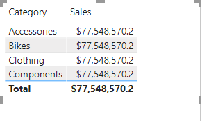

	*The issue is that the table is based on fields from different tables. The expectation is that each product category displays the sales for that category. However, because there isn’t a model relationship between these tables, the **Sales** table is not filtered. You’ll now add a relationship to propagate filters between the tables.*

8. On the **Modeling** ribbon tab, from inside the **Relationships** group, click **Manage Relationships**.

	

9. In the **Manage Relationships** window, notice that no relationships are yet defined.

10. To create a relationship, click **New**.

	

11. In the **Create Relationship** window, in the first dropdown list, select the **Product** table.

	

12. In the second dropdown list (beneath the **Product** table grid), select the **Sales** table.

	

13. Notice the **ProductKey** columns in each table have been automatically selected.

	*The columns were selected because they share the same name and data type.*

14. In the **Cardinality** dropdown list, notice that **One To Many (1:*)** is selected.

	*The cardinality was automatically detected, because Power BI understands that the **ProductKey** column from the **Product** table contains unique values. One-to-many relationships are the most common cardinality, and all relationship you create in this lab will be this type. You’ll work with a Many-to-many cardinality in the **Model Data in Power BI Desktop, Part 2** lab.*

15. In the **Cross Filter Direction** dropdown list, notice that **Single** is selected.

	*Single filter direction means that filters propagate from the “one side” to the “many side”. In this case, it means filters applied to the **Product** table will propagate to the **Sales** table, but not in the opposite direction. You’ll work with a bi-directional relationship in the **Model Data in Power BI Desktop, Part 2** lab.*

16. Notice that the **Mark This Relationship Active** is checked.

	*Active relationships propagate filters. It’s possible to mark a relationship as inactive so filters don’t propagate. Inactive relationships can exist when there are multiple relationship paths between tables. In this case, model calculations can use special functions to activate them. You’ll work with an inactive relationship in the **Model Data in Power BI Desktop, Part 2** lab.*

17. Click **OK**.

	

18. In the **Manage Relationships** window, notice that the new relationship is listed, and then click **Close**.

	

19. In the report, notice that the table visual updated to display different values for each product category.

	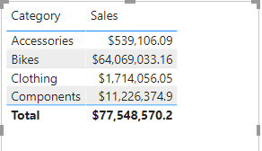

	*Filters applied to the **Product** table now propagate to the **Sales** table.*

20. Switch to Model view, and then notice there is now a connector between the two tables (it does not matter if the tables are positioned next to each other).

	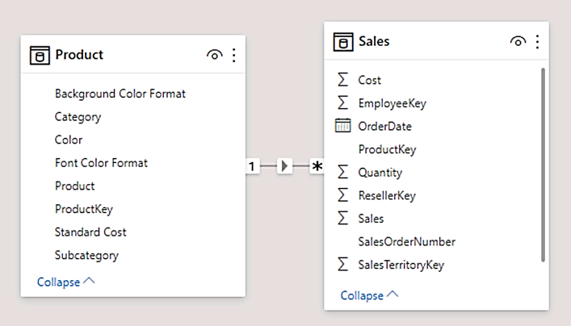

21. In the diagram, notice that you can interpret the cardinality which is represented by the **1** and ***** indicators.

	*Filter direction is represented by the arrow head. A solid line represents an active relationship; a dashed line represents an inactive relationship.*

22. Hover the cursor over the relationship to highlight the related columns.

	*There’s an easier way to create a relationship. In the model diagram, you can drag and drop columns to create a new relationship.*

23. To create a new relationship using a different technique, from the **Reseller** table, drag the **ResellerKey** column on to the **ResellerKey** column of the **Sales** table.

	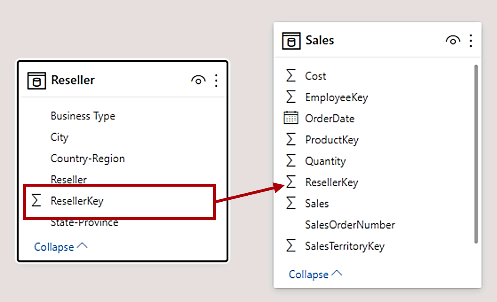

	*Tip: Sometime a column doesn’t want to be dragged. If this situation arises, select a different column, and then select the column you intend to drag again, and then try again. Ensure that you see the new relationship added to the diagram.*

24. Use the new technique to create the following two model relationships:

	- **Region \| SalesTerritoryKey** to **Sales \| SalesTerritoryKey**

	- **Salesperson \| EmployeeKey** to **Sales \| EmployeeKey**

	*In this lab the **SalespersonRegion** and **Targets** tables will remain disconnected. There’s a many-to-many relationship between salespeople and regions, and you’ll work with this advanced scenario in the **Model Data in Power BI Desktop, Part 2** lab.*

25. In the diagram, arrange the tables so that the **Sales** table is positioned in the center of the diagram, and the related tables are arranged about it. Position the disconnected tables to the side.

	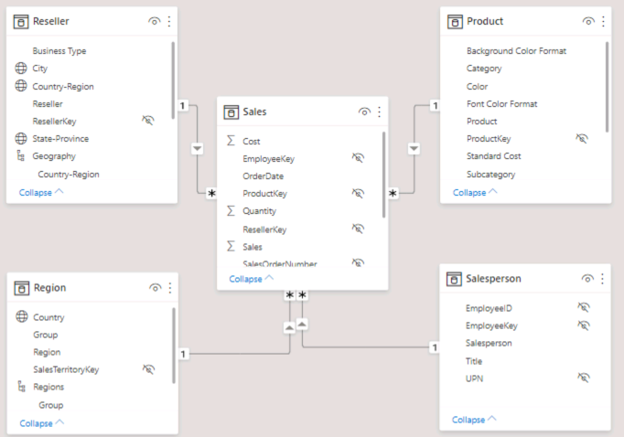

26. Save the Power BI Desktop file.

## **Exercise 2: Configure Tables**

In this exercise you will configure each table by creating hierarchies, and hiding, formatting, and categorizing columns.

### **Task 1: Configure the Product table**

In this task you will configure the **Product** table.

1. In Model view, in the **Fields** pane, if necessary, expand the **Product** table to reveal all fields.

2. To create a hierarchy, in the **Fields** pane, right-click the **Category** column, and then select **Create Hierarchy**.

	

3. In the **Properties** pane (to the left of the **Fields** pane), in the **Name** box, replace the text with **Products**.

	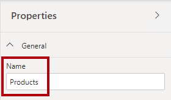

4. To add the second level to the hierarchy, in the **Properties** pane, in the **Hierarchy** dropdown list, select **Subcategory** (you might need to scroll down inside the pane).

5. To add the third level to the hierarchy, in the **Hierarchy** dropdown list, select **Product**.

6. To complete the hierarchy design, click **Apply Level Changes**.

	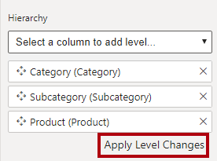

	*Tip: Don’t forget to click **Apply Level Changes**—it’s a common mistake to overlook this step.*

7. In the **Fields** pane, notice the **Products** hierarchy.

	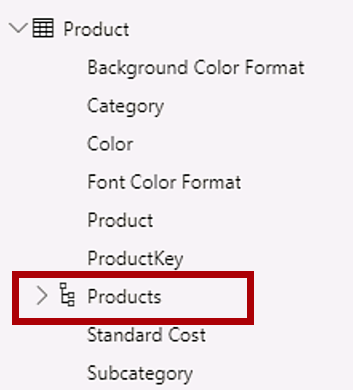

8. To reveal the hierarchy levels, expand the **Products** hierarchy.

	

9. To organize columns into a display folder, in the **Fields** pane, first select the **Background Color Format** column.

10. While pressing the **Ctrl** key, select the **Font Color Format** column.

11. In the **Properties** pane, in the **Display Folder** box, enter **Formatting**.

	

12. In the **Fields** pane, notice that the two columns are now inside a folder.

	

	*Display folders are a great way to declutter tables—especially for tables that comprise many fields.*

### **Task 2: Configure the Region table**

In this task you will configure the **Region** table.

1. In the **Region** table, create a hierarchy named **Regions**, with the following three levels:

	- Group

	- Country

	- Region

	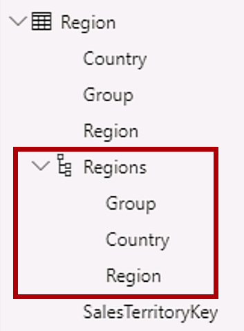

2. Select the **Country** column (not the **Country** hierarchy level).

3. In the **Properties** pane, expand the **Advanced** section (at the bottom of the pane), and then in the **Data Category** dropdown list, select **Country/Region**.

	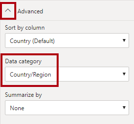

	*Data categorization can provide hints to the report designer. In this case, categorizing the column as country or region provides more accurate information to Power BI when it renders a map visualization.*

### **Task 3: Configure the Reseller table**

In this task you will configure the **Reseller** table.

1. In the **Reseller** table, create a hierarchy named **Resellers**, with the following two levels:

	- Business Type

	- Reseller

	

2. Create a second hierarchy named **Geography**, with the following four levels:

	- Country-Region

	- State-Province

	- City

	- Reseller

	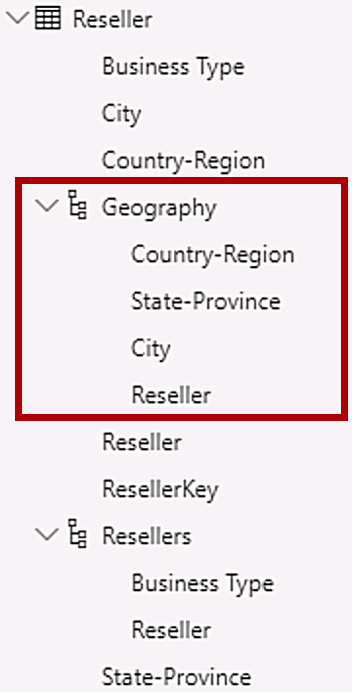

3. Categorize the following three columns:

	- **Country-Region** as **Country/Region**

	- **State-Province** as **State or Province**

	- **City** as **City**

### **Task 4: Configure the Sales table**

In this task you will configure the **Sales** table.

1. In the **Sales** table, select the **Cost** column.

2. In the **Properties** pane, in the **Description** box, enter: **Based on standard cost**

	

	*Descriptions can be applied to tables, columns, hierarchies, or measures. In the **Fields** pane, description text is revealed in a tooltip when a report author hovers their cursor over the field.*

3. Select the **Quantity** column.

4. In the **Properties** pane, from inside the **Formatting** section, slide the **Thousands Separator** property to **On**.

	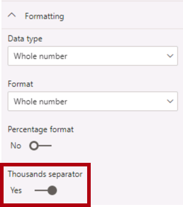

5. Select the **Unit Price** column.

6. In the **Properties** pane, from inside the **Formatting** section, slide the **Decimal Places** property to **2**.

7. In the **Advanced** group (you may need to scroll down to locate it), in the **Summarize By** dropdown list, select **Average**.

	

	*By default, numeric columns will summarize by summing values together. This default behavior is not suitable for a column like **Unit Price**, which represents a rate. Setting the default summarization to average will produce a meaningful result.*

### **Task 5: Bulk update properties**

In this task you will update multiple columns using single bulk updates. You will use this approach to hide columns, and format column values.

1. In the **Fields** pane, select the **Product \| ProductKey** column.

2. While pressing the **Ctrl** key, select the following 13 columns (spanning multiple tables):

	- Region \| SalesTerritoryKey

	- Reseller \| ResellerKey

	- Sales \| EmployeeKey
	
	- Sales \| ProductKey

	- Sales \| ResellerKey

	- Sales \| SalesOrderNumber

	- Sales \| SalesTerritoryKey

	- Salesperson \| EmployeeID

	- Salesperson \| EmployeeKey

	- Salesperson \| UPN

	- SalespersonRegion \| EmployeeKey

	- SalespersonRegion \| SalesTerritoryKey

	- Targets \| EmployeeID

3. In the **Properties** pane, slide the **Is Hidden** property to **On**.

	

	*The columns were hidden because they’re either used by relationships or will be used in row-level security configuration or calculation logic.*

	*You’ll define row-level security in the **Model Data in Power BI Desktop, Part 2** lab using the **UPN** column. You’ll use the **SalesOrderNumber** in a calculation in the **Create DAX Calculations in Power BI Desktop, Part 1** lab.*

4. Multi-select the following three columns:

	- Product \| Standard Cost

	- Sales \| Cost

	- Sales \| Sales

5. In the **Properties** pane, from inside the **Formatting** section, set the **Decimal Places** property to **0** (zero).

	

## **Exercise 3: Review the Model Interface**

In this exercise you will switch to Report view, and review the model interface.

### **Task 1: Review the model interface**

In this task you will switch to Report view, and review the model interface.

1. Switch to Report view.

2. In the **Fields** pane, notice the following:

	- Columns, hierarchies and their levels are fields, which can be used to configure report visuals

	- Only fields relevant to report authoring are visible

	- The **SalespersonRegion** table is not visible—because all of its fields are hidden

	- Spatial fields in the **Region** and **Reseller** table are adorned with a spatial icon

	- Fields adorned with the sigma symbol (Ʃ) will summarize, by default

	- A tooltip appears when hovering the cursor over the **Sales \| Cost** field

3. Expand the **Sales \| OrderDate** field, and then notice that it reveals a date hierarchy.

	

	*The **Targets \| TargetMonth** field delivers a similar hierarchy. These hierarchies were not created by you. They were created automatically. There is a problem, however. The Adventure Works financial year commences on July 1 of each year. But, in these automatically created date hierarchies, the date hierarchy year commences on January 1 of each year.*

	*You’ll now turn this automatic behavior off. In the **Create DAX Calculations in Power BI Desktop, Part 1** lab, you’ll use DAX to create a date table, and configure it define the Adventure Works’ calendar.*

4. To turn off auto/date time, click the **File** ribbon tab to open the backstage view.

5. At the left, select **Options and Settings**, and then select **Options**.

	

6. In the **Options** window, at the left, in the **Current File** group, select **Data Load**.

	

7. In the **Time Intelligence** section, uncheck **Auto Date/Time**.

	

8. Click **OK**.

	

9. In the **Fields** pane, notice that the date hierarchies are no longer available.

	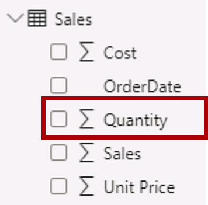

## **Exercise 4: Create Quick Measures**

In this exercise you will create two quick measures.

### **Task 1: Create quick measures**

In this task you will create two quick measures to calculate profit and profit margin.

1. In the **Fields** pane, right-click the **Sales** table, and then select **New Quick Measure**.

	

2. In the **Quick Measures** window, in the **Calculation** dropdown list, from inside the **Mathematical Operations** group, select **Subtraction**.

	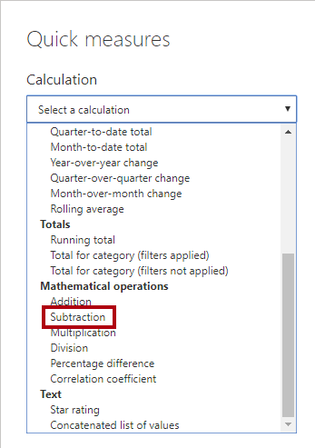

3. In the **Fields** pane of the **Quick Measures** window, expand the **Sales** table.

4. Drag the **Sales** field into the **Base Value** box.

5. Drag the **Cost** field into the **Value to Subtract** box.

	

6. Click **OK**.

	

	*A quick measure creates the calculation formula for you. They’re easy and fast to create for simple and common calculations. You’ll create measures without using this tool in the **Create DAX Calculations in Power BI Desktop, Part 1** lab.*

7. In the **Fields** pane, inside the **Sales** table, notice that new measure.

	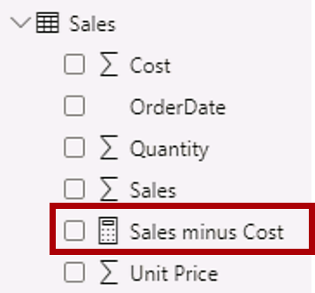

	*Measures are adorned with the calculator icon.*

8. To rename the measure, right-click it, and then select **Rename**.

	

	*Tip: To rename a field, you can also double-click it, or select it and press **F2**.*

9. Rename the measure to **Profit**, and then press **Enter**.

10. In the **Sales** table, add a second quick measure, based on the following requirements:

	- Use the **Division** mathematical operation

	- Set the **Numerator** to the **Sales \| Profit** field

	- Set the **Denominator** to **Sales \| Sales** field

	- Rename the measure as **Profit Margin**

	

	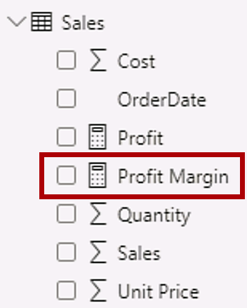

11. Ensure the **Profit Margin** measure is selected, and then on the **Measure Tools** contextual ribbon, set the format to **Percentage**, with two decimal places.

	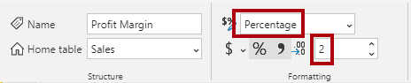

12. To test the two measures, first select the table visual on the report page.

13. In the **Fields** pane, check the two measures.

	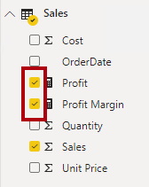

14. Click and drag the right guide to widen the table visual.

	

15. Verify that the measures produce reasonable results that are correctly formatted.

	

### **Task 2: Finish up**

In this task you will complete the lab.

1. To remove the table, select the table (by clicking it), and then press the **Delete** key.

2. Save the Power BI Desktop file.

3. If prompted to apply queries, click **Apply Later**.

4. If you intend to start the next lab, leave Power BI Desktop open.

	*You’ll enhance the data model by configuring a many-to-many relationship and row-level security in the **Model Data in Power BI Desktop, Part 2** lab.*
