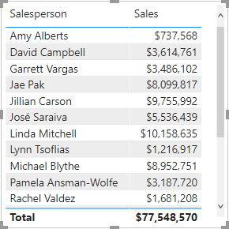
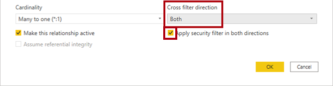
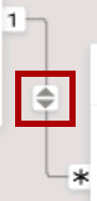
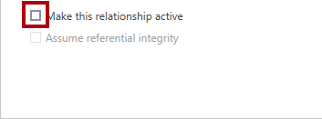
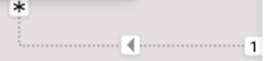

---
lab:
    title: 'Model Data in Power BI Desktop, Part 2'
    module: 'Module 4 - Design a Data Model in Power BI'
---

# **Model Data in Power BI Desktop, Part 2**

**The estimated time to complete the lab is 45 minutes**

In this lab you will create a many-to-many relationship between the **Salesperson** table and the **Sales** table. 

In this lab you learn how to:

- Configure many-to-many relationships

### **Lab story**

This lab is one of many in a series of labs that was designed as a complete story from data preparation to publication as reports and dashboards. You can complete the labs in any order. However, if you intend to work through multiple labs, for the first 10 labs, we suggest you do them in the following order:

1. Prepare Data in Power BI Desktop

2. Load Data in Power BI Desktop

3. Model Data in Power BI Desktop, Part 1

4. **Model Data in Power BI Desktop, Part 2**

5. Create DAX Calculations in Power BI Desktop, Part 1

6. Create DAX Calculations in Power BI Desktop, Part 2

7. Design a Report in Power BI Desktop, Part 1

8. Design a Report in Power BI Desktop, Part 2

9. Create a Power BI Dashboard

10. Create a Power BI Paginated Report

11. Perform Data Analysis in Power BI Desktop

12. Enforce Row-Level Security

## **Exercise 1: Create a Many-to many Relationship**

In this exercise you will create a many-to-many relationship between the **Salesperson** table and the **Sales** table.

### **Task 1: Get started**

In this task you will setup the environment for the lab.

*Important: If you are continuing on from the previous lab (and you completed that lab successfully), do not complete this task; instead, continue from the next task.*

1. To open the Power BI Desktop, on the taskbar, click the Microsoft Power BI Desktop shortcut.

 	

1. To close the getting started window, at the top-left of the window, click **X**.

 	

1. To open the starter Power BI Desktop file, click the **File** ribbon tab to open the backstage view.

1. Select **Open Report**.

 	

1. Click **Browse Reports**.

 	

1. In the **Open** window, navigate to the **D:\DA100\Labs\04-configure-data-model-in-power-bi-desktop-advanced\Starter** folder.

1. Select the **Sales Analysis** file.

1. Click **Open**.

 	

1. Close any informational windows that may open.

1. To create a copy of the file, click the **File** ribbon tab to open the backstage view.

1. Select **Save As**.

 	

1. If prompted to apply changes, click **Apply**.

 	

1. In the **Save As** window, navigate to the **D:\DA100\MySolution** folder.

1. Click **Save**.

 	

### **Task 2: Create a many-to-many relationship**

In this task you will create a many-to-many relationship between the **Salesperson** table and the **Sales** table.

1. In Power BI Desktop, in Report view, in the **Fields** pane, check the follow two fields to create a table visual:

	- Salesperson \| Salesperson

	- Sales \| Sales

	*The labs use a shorthand notation to reference a field. It will look like this: **Salesperson \| Salesperson** . In this example, **Salesperson**  is the table name and **Salesperson**  is the field name.*

	

	*The table displays sales made by each salesperson. However, there’s another relationship between salespeople and sales. Some salespeople belong to one, two, or possibly more sales regions. In addition, sales regions can have multiple salespeople assigned to them.*

	*From a performance management perspective, a salesperson’s sales (based on their assigned territories) need to be analyzed and compared with sales targets. You’ll create relationships to support this analysis in the next exercise.*

2. Notice that Michael Blythe has sold almost $9 million.

3. Switch to Model view.

	

4. Drag the **SalespersonRegion** table to position it between the **Region** and **Salesperson** tables.

5. Use the drag-and-drop technique to create the following two model relationships:

	- **Salesperson \| EmployeeKey** to **SalespersonRegion \| EmployeeKey**

	- **Region \| SalesTerritoryKey** to **SalespersonRegion \| SalesTerritoryKey**

	*The **SalespersonRegion** table can be considered to be a bridging table.*

6. Switch to Report view, and then notice that the visual has not updated—the sales result for Michael Blythe has not changed.

7. Switch back to Model view, and then follow the relationship filter directions (arrowhead) from the **Salesperson** table.

	*Consider that the **Salesperson** table filters the **Sales** table. It also filters the **SalespersonRegion** table, but it does not continue by propagating filters to the **Region** table (the arrowhead is pointing the wrong direction).*

	

8. To edit the relationship between the **Region** and **SalespersonRegion** tables, double-click the relationship.

9. In the **Edit Relationship** window, in the **Cross Filter Direction** dropdown list, select **Both**.

10. Check the **Apply Security Filter in Both Directions** checkbox.

	

11. Click **OK**.

	

12. Notice that the relationship has a double arrowhead.

	

13. Switch to Report view, and then notice that the sales values have still not changed.

	*The issue now relates to the fact that there are two possible filter propagation paths between the **Salesperson** and **Sales** tables. This ambiguity is internally resolved, based on a “least number of tables” assessment. To be clear, you shouldn’t design models with this type of ambiguity—the issue will be addressed in part later in this lab, and by the completion of the **Create DAX Calculations in Power BI Desktop, Part 1** lab.*

14. Switch to Model view.

15. To force filter propagation via the bridging table, edit (double-click) the relationship between the **Salesperson** and **Sales** tables.

16. In the **Edit Relationship** window, uncheck the **Make This Relationship Active** checkbox.

	

17. Click **OK**.

	

	*The filter propagation will now follow the only active path.*

18. In the diagram, notice that the inactive relationship is represented by a dashed line.

	

19. Switch to Report view, and then notice that the sales for Michael Blythe is now nearly $22 million.

	

20. Notice also, that the sales for each salesperson—if added—would exceed the table total.

	*It’s a common observation of a many-to-many relationship due to the double, triple, etc. counting of regional sales results. Consider Brian Welcker, the second salesperson listed. His sales amount equals the total sales amount. It’s the correct result simply due to the fact the he’s the Director of Sales; his sales are measured by the sales of all regions.*

	*While the many-to-many relationship is now working, it’s now not possible to analyze sales made by a salesperson (because the relationship is inactive). You’ll be able to reactivate the relationship when you introduce a calculated table that will allow analyzing sales made in the sales region(s) assigned to the salesperson (for performance analysis) in the **Create DAX Calculations in Power BI Desktop, Part 1** lab.*

21. Switch to Modeling view, and then in the diagram, select the **Salesperson** table.

22. In the **Properties** pane, in the **Name** box, replace the text with **Salesperson (Performance)**.

	*The renamed table now reflects its purpose: it’s used to report and analyze the performance of salespeople based on the sales of their assigned sales regions.*

### **Task 3: Relate the Targets table**

In this task you will create a relationship to the **Targets** table

1. Create a relationship from the **Salesperson (Performance) \| EmployeeID** column and the **Targets \| EmployeeID** column.

2. In Report view, add the **Targets \| Target** field to the table visual.

3. Resize the table visual so all columns are visible.

	

	*It’s now possible to visualize sales and targets—but take care for two reasons. First, there’s no filter on a time period, and so targets also include future target amounts. Second, targets are not additive, and so the total should not be displayed. They can either be disabled by formatting the visual or removed by using calculation logic. You’ll follow the second approach by creating a target measure in the **Create DAX Calculations in Power BI Desktop, Part 2** lab that’ll return BLANK when more than one salesperson is filtered.*

### **Task 4: Finish up**

In this task you will complete the lab.

1. Save the Power BI Desktop file.

2. If prompted to apply queries, click **Apply Later**.

3. If you intend to start the next lab, leave Power BI Desktop open.

	*You’ll enhance the data model with calculations using DAX in the **Create DAX Calculations in Power BI Desktop, Part 2** lab.*
