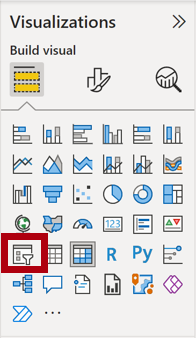
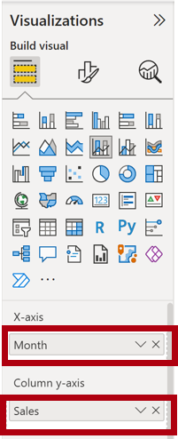

---
lab:
    title: 'Design a Report in Power BI Desktop, Part 1'
    module: 'Module 7 - Create Reports'
---

# **Design a Report in Power BI Desktop, Part 1**

**The estimated time to complete the lab is 45 minutes**

In this lab you will create a three-page report. You will then publish it to Power BI, whereupon you will open and interact with the report.

In this lab you learn how to:

- Design a report

- Configure visual fields and format properties

### **Lab story**

This lab is one of many in a series of labs that was designed as a complete story from data preparation to publication as reports and dashboards. You can complete the labs in any order. However, if you intend to work through multiple labs, for the first 10 labs, we suggest you do them in the following order:

1. Prepare Data in Power BI Desktop

2. Load Data in Power BI Desktop

3. Model Data in Power BI Desktop, Part 1

4. Model Data in Power BI Desktop, Part 2

5. Create DAX Calculations in Power BI Desktop, Part 1

6. Create DAX Calculations in Power BI Desktop, Part 2

7. **Design a Report in Power BI Desktop, Part 1**

8. Design a Report in Power BI Desktop, Part 2

9. Create a Power BI Dashboard

10. Create a Power BI Paginated Report

11. Perform Data Analysis in Power BI Desktop

12. Enforce Row-Level Security

## **Exercise 1: Create a Report**

In this exercise you will create a three-page report named **Sales Report**.

### **Task 1: Get started – Sign in**

In this task you will setup the environment for the lab by signing in to Power BI.

*Important: If you have already signed in to Power BI, continue from the next task.*

1. To open Microsoft Edge, on the taskbar, click the Microsoft Edge program shortcut.

 	

1. In the Microsoft Edge browser window, navigate to **https://powerbi.com**.

 	*Tip: You can also use the Power BI Service favorite on the Microsoft Edge favorites bar.*

1. Click **Sign In** (located at the top-right corner).

 	

1. Enter the account details provided to you (check out the **Resources**).

1. If prompted to update the password, reenter the provided password, and then enter and confirm a new password.

 	*Important: Be sure to record your new password.*

1. Complete the sign in process.

1. If prompted by Microsoft Edge to stay signed in, click **Yes**.

1. Leave the Microsoft Edge browser window open.

### **Task 2: Get started – Enable Map and filled map visuals**

In this task you will enable map and filled map visuals in the environment for the lab by updating the Integration settings in the Power BI Admin portal. 

1. To open the Power BI Admin portal, at the top-right of the browser, click the **Settings** icon.

 	

1. Select **Admin portal**.

 	

1. Scroll down the page to Integration settings. Click the arrow to expand the Map and filled map visuals option.

 	

1. Set the Map and filled map visuals option to **Enabled**.

1. Click **Apply**, to apply the changes. 

	

1. A message will appear at the top-right of the browser stating the Tenant settings changes will be applied within the next 15 minutes. 

	

1. Leave the Microsoft Edge browser window open.

### **Task 3: Get started – Open report**

In this task you will setup the environment for the lab by opening the starter report.

*Important: If you are continuing on from the previous lab (and you completed that lab successfully), do not complete this task; instead, continue from the next task.*

1. To open the Power BI Desktop, on the taskbar, click the Microsoft Power BI Desktop shortcut.

	

2. To close the getting started window, at the top-left of the window, click **X**.

	

3. To sign in to the Power BI service, at the top-right, click **Sign In**.

	

4. Complete the sign in process using the same account used to sign in to the Power BI service.

5. To open the starter Power BI Desktop file, click the **File** ribbon tab to open the backstage view.

6. Select **Open Report**.

	

7. Click **Browse Reports**.

	

8. In the **Open** window, navigate to the **D:\DA100\Labs\07-design-report-in-power-bi-desktop\Starter** folder.

9. Select the **Sales Analysis** file.

10. Click **Open**.

	

11. Close any informational windows that may open.

12. To create a copy of the file, click the **File** ribbon tab to open the backstage view.

13. Select **Save As**.

	

14. If prompted to apply changes, click **Apply**.

	

15. In the **Save As** window, navigate to the **D:\DA100\MySolution** folder.

16. Click **Save**.

	

### **Task 4: Design page 1**

In this task you will design the first report page. When you’ve completed the design, the page will look like the following:

1. In Power BI Desktop, to rename the page, at the bottom-left, right-click **Page 1**, and then select **Rename**.

	

	*Tip: You can also double-click the page name to rename it.*

2. Rename the page as **Overview**, and then press **Enter**.

	

3. To add an image, on the **Insert** ribbon tab, from inside the **Elements** group, click **Image**.

	

4. In the **Open** window, navigate to the **D:\DA100\Resources** folder.

5. Select the **AdventureWorksLogo.jpg** file, and then click **Open**.

	

6. Drag the image to position it at the top-left corner, and also drag the guide markers to resize it.

	

7. To add a slicer, first de-select the image by clicking an empty area of the report page.
8. In the **Fields** pane, select the **Date \| Year** field (not the **Year** level of the hierarchy).
	
	*The labs use a shorthand notation to reference a field. It will look like this: **Date \| Year**. In this example, **Date** is the table name and **Year** is the field name.*

9. Notice that a table of year values has been added to the report page.

10. To convert the visual from a table to a slicer, in the **Visualizations** pane, select the **Slicer**.

	

11. To convert the slicer from a list to a dropdown, at the top-right of the slicer, click the down-arrow, and then select **Dropdown**.

	

12. Resize and position the slicer so it sits beneath the image and is the same width as the image.

	

13. In the **Year** slicer, open the dropdown list, select **FY2020**, and then collapse the dropdown list.

	

	*The report page is now filtered by year **FY2020**.*

14. De-select the slicer by clicking an empty area of the report page.

15. Create a second slicer, based on the **Region \| Region** field (not the **Region** level of the hierarch).

16. Leave the slicer as a list, and then resize and position the slicer beneath the **Year** slicer.

	

17. To format the slicer, beneath the **Visualizations** pane, open the **Format** pane.

	

18. Expand the **Selection Controls** group.

	

19. Set the **Show “Select All” Option** to **On**.

	

20. In the **Region** slicer, notice that the first item is now **Select All**.

	*When selected, this item either selects all or de-selects all items. It makes it easier for report users to set the required slicer items.*

21. De-select the slicer by clicking an empty area of the report page.

22. To add a chart to the page, in the **Visualizations** pane, click the **Line and Stacked Column Chart** visual type.

	

23. Resize and position the visual so it sits to the right of the logo, and so it fills the width of the report page.

	

24. Drag and drop the following fields into the visual:

	- Date \| Month

	- Sales \| Sales

25. In the visual fields pane (not the **Fields** pane—the visual fields pane is located beneath the **Visualizations** pane), notice that the fields are assigned to the **Shared Axis** and **Column Values** wells/areas.

	

	*By dragging fields into a visual, they will be added to default wells/areas. For precision, you can drag fields directly into the wells/areas, as you will do next.*

26. From the **Fields** pane, drag the **Sales \| Profit Margin** field into the **Line Values** well/area.

	

27. Notice that the visual has 11 months only.

	*The last month of the year, 2020 June, does not have any sales (yet). By default, the visual has eliminated months with BLANK sales. You will now configure the visual to show all months.*

28. In the visual fields pane, in the **Shared Axis** well/area, for the **Month** field, click the down-arrow, and then select **Show Items With No Data**.

	

29. Notice that the month **2020 June** now appears.

30. De-select the chart by clicking an empty area of the report page.

31. To add a chart to the page, in the **Visualizations** pane, click the **Map** visual type.

	

32. Resize and position the visual so it sits beneath the column/line chart, and so it fills half the width of the chart above.

	

33. Add the following fields to the visual wells/areas:

	- Location: **Region \| Country**

	- Legend: **Product \| Category**

	- Size: **Sales \| Sales**

34. De-select the chart by clicking an empty area of the report page.

35. To add a chart to the page, in the **Visualizations** pane, click the **Stacked Bar Chart** visual type.

	

36. Resize and position the visual so it fills the remaining report page space.

	

37. Add the following fields to the visual wells/areas:

	- Axis: **Product \| Category**

	- Value: **Sales \| Quantity**

38. To format the visual, open the **Format** pane.

	

39. Expand the **Data Colors** group, and then set the **Default Color** property to a suitable color (to complement the column/line chart).

40. Set the **Data Labels** property to **On**.

	

41. Save the Power BI Desktop file.

	*The design of the first page is now complete.*

### **Task 5: Design page 2**

In this task you will design the second report page. When you’ve completed the design, the page will look like the following:

*Important: When detailed instructions have already been provided in the labs, the lab steps will provide more concise instructions. If you need the detailed instructions, you can refer back to other tasks in this lab.*

1. To create a new page, at the bottom-left, click the plus icon.

	

2. Rename the page to **Profit**.

	

  
‎ 

3. Add a slicer based on the **Region \| Region** field.

4. Use the **Format** pane to enable the “Select All” option (in the **Selection Controls** group).

5. Resize and position the slicer so it sits at the left side of the report page, and so it is about half the page height.

	

6. Add a matrix visual, and resize and position it so it fills the remaining space of the report page

	

7. Add the **Date \| Fiscal** hierarchy to the matrix **Rows** well/area.

	

8. Add the following five **Sales** table fields to the **Values** well/area:

	- Orders (from the **Counts** folder)

	- Sales

	- Cost

	- Profit

	- Profit Margin

	

9. In the **Filters** pane (located at the left of the **Visualizations** pane), notice the **Filter On This Page** well/area (you may need to scroll down).

	

10. From the **Fields** pane, drag the **Product \| Category** field into the **Filter On This Page** well/area.

11. Inside the filter card, at the top-right, click the arrow to collapse the card.

	

	*Fields added to the **Filters** pane can achieve the same result as a slicer. One difference is they don’t take up space on the report page. Another difference is that they can be configured to achieve more sophisticated filtering requirements.*

12. Add each of the following **Product** table fields to the **Filter On This Page** well/area, collapsing each, directly beneath the **Category** card:

	- Subcategory

	- Product

	- Color

	

13. Save the Power BI Desktop file.

	*The design of the second page is now complete.*

### **Task 6: Design page 3**

In this task you will design the third—and final—report page. When you’ve completed the design, the page will look like the following:

1. Create a new page, and then rename it as **My Performance**.

1. To simulate the performance of row-level security filters, drag the **Salesperson (Performance) \| Salesperson** field to the page level filters in the filter pane.
	
	 

1. Select **Michael Blythe**. Data on the **My Performance** report page will now be filtered to display data for Michael Blythe only.

1. Add a dropdown slicer based on the **Date \| Year** field, and then resize and position it so it sits at the top-left corner of the page.

	

1. In the slicer, set the page to filter by **FY2019**.

	

1. Add a **Multi-row Card** visual, and then resize and reposition it so it sits to the right of the slicer and fills the remaining width of the page.

	

	

1. Add the following four fields to the visual:

	- Sales \| Sales

	- Targets \| Target

	- Targets \| Variance

	- Targets \| Variance Margin

1. Format the visual:

	- In the **Data Labels** group, increase the **Text Size** property to **28pt**

	- In the **Background** group, set the **Color** to a light gray color

	

1. Add a **Clustered Bar Chart** visual, and then resize and position it so it sits beneath the multi-row card visual and fills the remaining height of the page, and half the width of the multi-row card visual.

	

	

1. Add the following fields to the visual wells/areas:

	- Axis: **Date \| Month**

	- Value: **Sales \| Sales** and **Targets \| Target**

	

1. To create a copy of the visual, press **Ctrl+C**, and then press **Ctrl+V**.

1. Position the new visual to the right of the original visual.

	

1. To modify the visualization type, in the **Visualizations** pane, select **Clustered Column Chart**.

	

	*It’s now possible to see the same data expressed by two different visualization types. This isn’t a good use of the page layout, however, you’ll improve it in the **Design a Report in Power BI Desktop, Part 2** lab by superimposing the visuals. By adding buttons to the page, you’ll allow the report user to determine which of the two visuals is visible.*

	*The design of the third—and final—page is now complete.*

### **Task 7: Publish the report**

In this task you will publish the report.

1. Select the **Overview** page.

2. Save the Power BI Desktop file.

3. On the **Home** ribbon tab, from inside the **Share** group, click **Publish**.

	

4. In the **Publish to Power** BI window, notice that **My Workspace** is selected.

5. To publish the report, click **Select**.

	

6. When the publication has succeeded, click **Got It**.

	

7. Leave Power BI Desktop open.

	*You’ll explore the report in the Power BI service in the next exercise.*

## **Exercise 2: Explore the Report**

In this exercise you will explore the report that was published to Power BI.

### **Task 1: Explore the report**

In this task you will explore the report that was published to Power BI.

1. In the Microsoft Edge browser window, in the Power BI service, in the **Navigation** pane (located at the left, and it could be collapsed), expand **My Workspace**.

	

2. Review the contents of the workspace, noticing the **Sales Analysis** report and dataset.

	*When you published the Power BI Desktop file, the data model was published as a dataset.*

	*If you don’t see it, press **F5** to reload the browser, and then expand the workspace again.*

	

3. To open the report, click the **Sales Analysis** report.

4. At the left, in the **Pages** pane, select the **Overview** page. 

5. In the **Regions** slicer, while pressing the **Ctrl** key, select multiple regions.

6. In the column/line chart, select any month column to cross filter the page.

7. While pressing the **Ctrl** key, select an additional month.

	*By default, cross filtering filters all other visuals on the page.*

8. Notice that the bar chart is filtered and highlighted, with the bold portion of the bars representing the filtered months.

9. Hover the cursor over the bar chart visual, and then at the top-right, hover the cursor over the filter icon.

	

	*The filter icon allows you to understand all filters that are applied to the visual, including slicers and cross filters from other visual.*

10. Hover the cursor over a bar, and then notice the tooltip information.

11. To undo the cross filter, in the column/line chart, click an empty area of the visual.

12. Hover the cursor over the map visual, and then at the top-right, click the **Focus mode** icon.

	

	*Focus mode zooms the visual to full page size.*

13. Hover the cursor over different segments of the bar charts to reveal tooltips.

14. To return to the report page, at the top-left, click **Back to Report**.

	

15. Hover the cursor over the map visual again, and then at the top-right, click the ellipsis (…), and then notice the menu options.

	

16. Try out each of the options, except **Chat in Teams**.

17. At the left, in the **Pages** pane, select the **Profit** page.

	

18. Notice that the **Region** slicer has a different selection to the **Region** slicer on the **Overview** page.

	*The slicers are not synchronized. You’ll modify the report design to ensure they sync between pages in the **Design a Report in Power BI Desktop, Part 2** lab.*

19. In the **Filters** pane (located at the right), expand a filter card, and apply some filters.

	*The **Filters** pane allows you to define more filters than could possibly fit on a page as slicers.*

20. In the matrix visual, use the plus (+) button to drill into the **Fiscal** hierarchy.

21. Select the **My Performance** page.

	

22. At the top-right on the menu bar, click **View**, and then select **Full Screen**.

	

23. Interact with the page by modifying the slicer, and cross filtering the page.

24. At the bottom of the window, notice the commands to change page, navigate backwards or forwards between pages, or to exit full screen mode.

25. Click the left icon to exit full screen mode.

	

### **Task 2: Finish up**

In this task you will complete the lab.

1. To return to your workspace, in the banner across the window web page, click **My Workspace**.

	

2. Leave the Microsoft Edge browser window open.

	*You will enhance the report design with advanced features in the **Design a Report in Power BI Desktop, Part 2** lab.*
