---
lab:
    title: 'Create a Power BI Dashboard'
    module: 'Module 8 - Create Dashboards'
---

# **Create a Power BI Dashboard**

**The estimated time to complete the lab is 45 minutes**

In this lab you will create the **Sales Monitoring** dashboard.

In this lab you learn how to:

- Pin visuals to a dashboard

- Use Q&A to create dashboard tiles

- Configure a dashboard tile alert

### **Lab story**

This lab is one of many in a series of labs that was designed as a complete story from data preparation to publication as reports and dashboards. You can complete the labs in any order. However, if you intend to work through multiple labs, for the first 10 labs, we suggest you do them in the following order:

1. Prepare Data in Power BI Desktop

2. Load Data in Power BI Desktop

3. Model Data in Power BI Desktop, Part 1

4. Model Data in Power BI Desktop, Part 2

5. Create DAX Calculations in Power BI Desktop, Part 1

6. Create DAX Calculations in Power BI Desktop, Part 2

7. Design a Report in Power BI Desktop, Part 1

8. Design a Report in Power BI Desktop, Part 2

9. **Create a Power BI Dashboard**

10. Create a Power BI Paginated Report

11. Perform Data Analysis in Power BI Desktop

12. Enforce Row-Level Security

## **Exercise 1: Create a Dashboard**

In this exercise you will create the **Sales Monitoring** dashboard. The completed dashboard will look like the following:

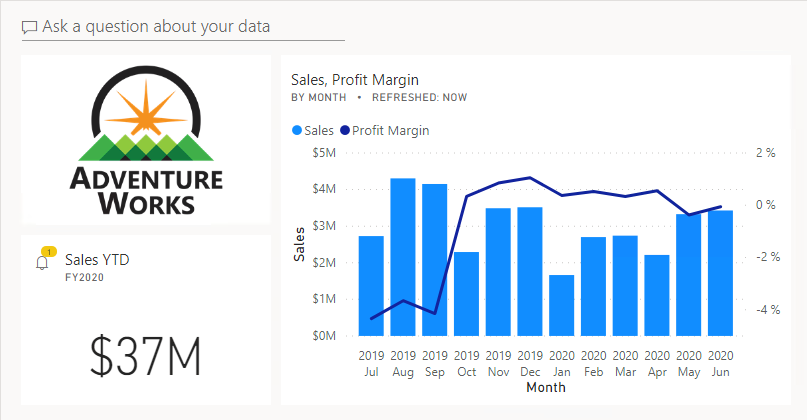

### **Task 1: Get started – Sign in**

In this task you will setup the environment for the lab by signing in to Power BI.

*Important: If you have already signed in to Power BI in a previous lab, continue from the next task.*

1. To open Microsoft Edge, on the taskbar, click the Microsoft Edge program shortcut.

    

2. In the Microsoft Edge browser window, navigate to **https://powerbi.com**.

    *Tip: You can also use the Power BI Service favorite on the Microsoft Edge favorites bar.*

3. Click **Sign In** (located at the top-right corner).

    

4. Enter the account details provided to you.

5. If prompted to update the password, reenter the provided password, and then enter and confirm a new password.

    *Important: Be sure to record your new password.*

6. Complete the sign in process.

7. If prompted by Microsoft Edge to stay signed in, click **Yes**.

8. In the Microsoft Edge browser window, in the Power BI service, in the **Navigation** pane, expand **My Workspace**.

    

9. Leave the Microsoft Edge browser window open.

### **Task 2: Get started – Open report**

In this task you will setup the environment for the lab by opening the starter report.

*Important: If you are continuing on from the previous lab (and you completed that lab successfully), do not complete this task; instead, continue from the next task.*

1. To open the Power BI Desktop, on the taskbar, click the Microsoft Power BI Desktop shortcut.

    

2. To close the getting started window, at the top-left of the window, click **X**.

    

3. If Power BI Desktop is not signed in to the Power BI service, at the top-right, click **Sign In**.

    

4. Complete the sign in process using the same account used to sign in to the Power BI service.

5. To open the starter Power BI Desktop file, click the **File** ribbon tab to open the backstage view.

6. Select **Open Report**.

    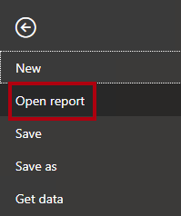

7. Click **Browse Reports**.

    

8. In the **Open** window, navigate to the **D:\DA100\Labs\09-create-power-bi-dashboard\Starter** folder.

9. Select the **Sales Analysis** file.

10. Click **Open**.

    

11. Close any informational windows that may open.

12. To create a copy of the file, click the **File** ribbon tab to open the backstage view.

13. Select **Save As**.

    

14. If prompted to apply changes, click **Apply**.

    

15. In the **Save As** window, navigate to the **D:\DA100\MySolution** folder.

16. Click **Save**.

    

### **Task 3: Get started – Publish the report**

In this task you will setup the environment for the lab by creating a dataset.

*Important: If you have already published the report in the **Design a Report in Power BI Desktop, Part 2** lab, continue from the next task.*

1. In the Microsoft Edge browser window, in the Power BI service, in the **Navigation** pane, at the bottom, click **Get Data**.

    

2. In the **Files** tile, click **Get**.

    

3. Click the **Local File** tile.

    

4. In the **Open** window, navigate to the **D:\DA100\Labs\08-design-report-in-power-bi-desktop-enhanced\Solution** folder.

5. Select the **Sales Analysis.pbix** file, and then click **Open**.

6. If prompted to replace the dataset, click **Replace**.

### **Task 4: Create a dashboard**

In this task you will create the **Sales Monitoring** dashboard. You will pin a visual from the report, and add a tile based on an image data URI, and use Q&A to create a tile.

1. In the Microsoft Edge browser window, in the Power BI service, open the **Sales Analysis** report.

2. In the **Overview** page, set the **Year** slicer to **FY2020**.

    

3. Set the **Region** slicer to **Select All**.

    *When pinning visuals to a dashboard, they will use the current filter context. Once pinned, the filter context cannot be changed. For time-based filters, it’s a better idea to use a relative date slicer (or, Q&A using a relative time-based question).*

4. To create a dashboard and pin a visual, hover the cursor over the **Sales and Profit Margin by Month** (column/line) visual.

5. At the top-right corner, click the pushpin.

    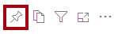

6. In the **Pin to Dashboard** window, in the **Dashboard Name** box, enter **Sales Monitoring**.

    

7. Click **Pin**.

    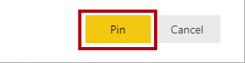

8. Open the **Navigation** pane, and then open the **Sales Monitoring** dashboard.

    

9. Notice that the dashboard has a single tile.

    

10. To add a tile based on a question, at the top-left of the dashboard, click **Ask a Question About Your Data**.

    

    *You can use the Q&A feature to ask a question, and Power BI will respond will a visual.*

11. Click any one of the suggested questions beneath the Q&A box, in blue boxes.

12. Review the response.

13. Remove all text from the Q&A box.

14. In the Q&A box, enter the following: **Sales YTD**

    

15. Notice the response of **(Blank)**.

    

    *You may recall you added the **Sales YTD** measure in the **Create DAX Calculations in Power BI Desktop, Part 2** lab. This measure is a Time Intelligence expression and it so requires a filter on the **Date** table to produce a result.*

16. Extend the question with: **in year FY2020**.

    

17. Notice the response is now **$33M**.

    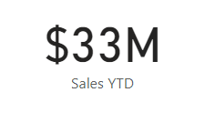

18. To pin the response to the dashboard, at the top-right corner, click **Pin Visual**.

    

19. When prompted to pin the tile to the dashboard, click **Pin**.

    

20. To return to the dashboard, at the top-left corner, click **Exit Q&amp;A**.

    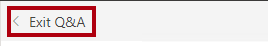

21. To add the company logo, on the menu bar, click **Edit**, and then select **Add a Tile**.

    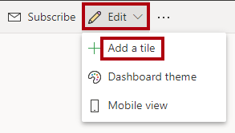

    *Using this technique to add a dashboard tile lets you embellish your dashboard with media, including web content, images, richly-formatted text boxes, and video (using YouTube or Vimeo links).*

22. In the **Add a Tile** pane (located at the right), select the **Image** tile.

    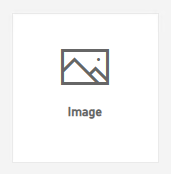

23. Click **Next**.

    

24. In the **Add Image Tile** pane, in the **URL** box, enter the complete URL found in the **D:\DA100\Resources\AdventureWorksLogo_DataURL.txt** file.

    *You can embed an image by using its URL, or you can use a data URL, which embeds content inline.*

25. At the bottom of the pane, click **Apply**.

    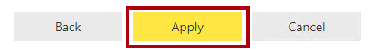

26. To resize the logo tile, drag the bottom-right corner, and resize the tile to become one unit wide, and two units high.

    *Tile sizes are constrained into a rectangular shape. It’s only possible to resize into multiples of the rectangular shape.*

27. Organize the tiles so that the logo appears at the top-left, with the **Sales YTD** tile beneath it, and the **Sales, Profit Margin** tile at the right.

    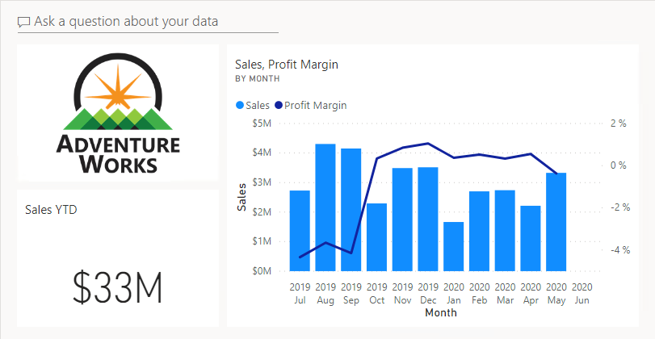

### **Task 5: Edit tile details**

In this task you will edit the details of two tiles.

1. Hover the cursor over the **Sales YTD** tile, and then at the top-right of the tile, click the ellipsis, and then select **Edit Details**.

    

2. In the **Tile Details** pane (located at the right), in the **Subtitle** box, enter **FY2020**.

    

3. Click **Apply**.

    

4. Notice that the **Sales YTD** tile displays a subtitle.

    

5. Edit the tile details for the **Sales, Profit Margin** tile.

6. In the **Tile Details** pane, in the **Functionality** section, check **Display Last Refresh Time**.

    

7. Click **Apply**.

    

8. Notice that the tile describes the last refresh time (which done when loading the data model in Power BI Desktop).

    *You’ll simulate a data refresh later in this lab and see that the refresh time updates.*

### **Task 6: Configure an alert**

In this task you will configure a data alert.

Data alerts can only be configured on dashboard tiles, and specifically tiles that display a single numeric value.

1. Hover the cursor over the **Sales YTD** tile, click the ellipsis, and then select **Manage Alerts**.

    

2. In the **Manage Alerts** pane (located at the right), click **Add Alert Rule**.

    

3. In the **Threshold** box, replace the value with **35000000** (35 million).

    

    *This configuration ensures you’ll be notified whenever the tile updates to a value above 35 million.*

4. At the bottom of the pane, click **Save and Close**.

    

    *You’ll refresh the dataset in the next exercise. Typically, this would be achieved by using scheduled refresh, in which case Power BI would use a gateway to connect to the SQL Server database. However, due to constraints in the classroom setup, there is no gateway. So, you’ll open Power BI Desktop, perform a manual data refresh, and then upload the file to your workspace.*

## **Exercise 2: Refresh the Dataset**

In this exercise you will first load sales order data for June 2020 into the **AdventureWorksDW2020** database. You will then open your Power BI Desktop file, perform a data refresh, and then upload the file to your workspace.

### **Task 1: Update the lab database**

In this task you will run a PowerShell script to update data in the **AdventureWorksDW2020** database.

1. In File Explorer, inside the **D:\DA100\Setup** folder, right-click the **UpdateDatabase-2-AddSales.ps1** file, and then select **Run with PowerShell**.

    

2. If prompted to change the execution policy, press **A**.

3. When prompted to press any key to close, press **Enter** again.

    *The **AdventureWorksDW2020** database now includes sales orders made in June 2020.*

### **Task 2: Refresh the Power BI Desktop file**

In this task you will open the **Sales Analysis** Power BI Desktop file, perform a data refresh, and then upload the file to your **Sales Analysis** workspace.

1. In Power BI Desktop file, in the **Fields** pane, right-click the **Sales** table, and then select **Refresh Data**.

    

2. When the refresh completes, save the Power BI Desktop file.

3. To publish the file to your workspace, on the **Home** ribbon tab, from inside the **Share** group, click **Publish**.

    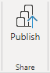

4. When prompted to replace the dataset, click **Replace**.

    

    *The dataset in the Power BI service now has June 2020 sales data.*

5. Close Power BI Desktop.

## **Exercise 3: Review the Dashboard**

In this exercise you will review the dashboard to notice updated sales, and that the alert was triggered.

### **Task 1: Review the dashboard**

In this task you will review the dashboard to notice updated sales, and that the alert was triggered.

1. In the Microsoft Edge browser window, in the Power BI service, review the **Sales Monitoring** dashboard.

2. In the **Sales, Profit Margin** tile, in the subtitle, notice that the data was refreshed **NOW**.

3. Notice also that there is now a column for **2020 Jun**.

    *If you don’t see the June 2020 data, you might need to press **F5** to reload the web browser.*

    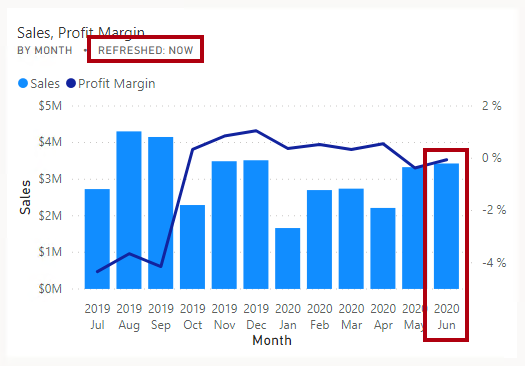

    *The alert on the **Sales YTD** tile should have triggered also. After a short while, the alert should notify you that sales now exceeds the configured threshold value.*

4. Notice that the **Sales YTD** tile has updated to **$37M**.

5. Verify that the **Sales YTD** tile displays an alert notification icon.

    *If you don’t see the notification, you might need to press **F5** to reload the browser. If you still don’t see the notification, wait some minutes longer.*

    

    *Alert notifications appear on the dashboard tile, and can be delivered by email, and push notifications to mobile apps including the Apple Watch.*

6. At the top-right corner of the web page, click the **Notifications** icon.

    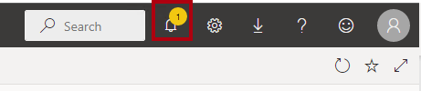

7. In the **All Notifications** pane, review the details of the alert notification.

8. To close the pane, click **Close**.
