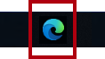
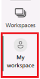

---
lab:
    title: 'Create a Power BI Dashboard'
    module: '11 - Create Dashboards'
---

# **Create a Power BI Dashboard**

**The estimated time to complete the lab is 45 minutes**

In this lab, you'll create the **Sales Monitoring** dashboard.

In this lab you learn how to:

- Pin visuals to a dashboard
- Use Q&A to create dashboard tiles

### **Lab story**

This lab is one of many in a series of labs that was designed as a complete story from data preparation to publication as reports and dashboards. You can complete the labs in any order. However, if you intend to work through multiple labs, we suggest you do them in the following order:

1. Prepare Data in Power BI Desktop
1. Load Data in Power BI Desktop
1. Model Data in Power BI Desktop
1. Create DAX Calculations in Power BI Desktop, Part 1
1. Create Advanced DAX Calculations in Power BI Desktop, Part 2
1. Design a Report in Power BI Desktop, Part 1
1. Enhance a Report in Power BI Desktop, Part 2
1. Perform Data Analysis in Power BI Desktop
1. **Create a Power BI Dashboard**
1. Enforce Row-Level Security

## **Exercise 1: Create a Dashboard**

In this exercise, you'll create the **Sales Monitoring** dashboard. The completed dashboard will look like the following:

### **Task 1: Get started – Sign in**

In this task, you'll set up the environment for the lab by signing in to Power BI.

*Note: If you've already signed in to Power BI, skip to the next task.*

1. To open Microsoft Edge, on the taskbar, select the Microsoft Edge program shortcut.

     

1. In the Microsoft Edge browser window, navigate to **https://app.powerbi.com**.

    *Tip: You can also use the Power BI Service favorite on the Microsoft Edge favorites bar.*

1. Complete the sign-in process with your organizational credentials (or those provided to you). If prompted by Microsoft Edge to stay signed in, select **Yes**.

1. In the Microsoft Edge browser window, in the Power BI service, in the **Navigation** pane, expand **My Workspace**. Leave the Microsoft Edge browser window open.

     

### **Task 2: Get started – Open report**

In this task, you'll set up the environment for the lab by opening the starter report.

*Important: If you're continuing on from the previous lab (and you completed that lab successfully), don't complete this task; instead, continue from the next task.*

1. Open Power BI Desktop.
    
	*By default, the Getting Started dialog box opens in front of Power BI Desktop. Sign-in, and then close the pop-up.*

    

1. To open the starter Power BI Desktop file, select the **File > Open Report > Browse Reports**.

1. In the **Open** window, navigate to the **D:\PL300\Labs\09-create-power-bi-dashboard\Starter** folder, and open the **Sales Analysis** file.

1. Close any informational windows that may open.

1. Notice the yellow warning message beneath the ribbon. *This message alerts you to the fact that the queries haven't been applied to load as model tables. You’ll apply the queries later in the lab.*
    
	*To dismiss the warning message, at the right of the yellow warning message, select **X**.*

1. To create a copy of the file, go to **File > Save As** and save to **D:\PL300\MySolution** folder.

1. If prompted to apply changes, select **Apply Later**.

### **Task 3: Get started – Publish the report**

In this task, you'll set up the environment for the lab by creating a dataset.

*Important: If you're continuing from the previous lab in the same VM, skip the next task.*

1. In the Microsoft Edge browser window, in the Power BI service, navigate to **My Workspace**.

1. Select **New > Dataset**. This opens the **Get Data** page, and under **Create new content > Files**, select **Get**.

1. Select the **Local file** option, and navigate to **D:\PL300\Labs\09-create-power-bi-dashboard\Solution** folder.

1. Select the **Sales Analysis.pbix** file, and then select **Open**.
    
	*If prompted to replace the dataset, select **Replace it**.*

### **Task 4: Create a dashboard**

In this task, you'll create the **Sales Monitoring** dashboard. You'll pin a visual from the report, and add a tile based on an image data URI, and use Q&A to create a tile.

1. In the Power BI service, open the **Sales Analysis** report.

1. In the **Overview** page, set the **Year** slicer to **FY2020**.

    

1. Set the **Region** slicer to **Select All**.
    
	*Pinned visuals are set with the filter context at time of pin. If the underlying visual changes, you'll need to update the dashboard tile as well. For time-based filters, it’s a better idea to use a relative date slicer (or, Q&A using a relative time-based question).*

1. To create a dashboard and pin a visual, hover the cursor over the **Sales and Profit Margin by Month** (column/line) visual.

1. At the bottom-right corner, select the pushpin.

    

1. In the **Pin to Dashboard** window, in the **Dashboard Name** box, enter **Sales Monitoring**, then select **Pin**.

    

1. Open **My Workspace** and open the **Sales Monitoring** dashboard.

1. Notice that the dashboard has a single tile.

    

1. To add a tile based on a question, at the top-left of the dashboard, select **Ask a Question About Your Data**.
    
	*You can use the Q&A feature to ask a question, and Power BI will respond will a visual.*

    

1. Select any one of the suggested questions beneath the Q&A box, in blue boxes, and review the response.

1. Remove all text from the Q&A box, and enter the following: **Sales YTD**

1. Notice the response of **(Blank)**.
    
	*You may recall you added the **Sales YTD** measure in the **Create Advanced DAX Calculations in Power BI Desktop, Part 2** lab. This measure is a Time Intelligence expression and it so requires a filter on the **Date** table to produce a result.*

    

1. Extend the question with: **in year FY2020**.

1. Notice the response is now **$33M**.

    

1. To pin the response to the dashboard, at the top-right corner, select **Pin Visual**.

    

1. When prompted to pin the tile to the dashboard, select **Pin**.

1. To return to the dashboard, at the top-left corner, select **Exit Q&amp;A**.

1. To add the company logo, on the menu bar, select **Edit**, and then select **Add a Tile**.
    
	*Using this technique to add a dashboard tile lets you enhance your dashboard with media, including web content, images, richly formatted text boxes, and video (using YouTube or Vimeo links).*

1. In the **Add a Tile** pane (located at the right), select the **Image** tile, then **Next**.

1. In the **Add Image Tile** pane, in the **URL** box, enter the complete URL found in the **D:\PL300\Resources\AdventureWorksLogo_DataURL.txt** file, and then **Apply**.
    
	*You can embed an image by using its URL, or you can use a data URL, which embeds content inline.*

1. To resize the logo tile, drag the bottom-right corner, and resize the tile to become one unit wide, and two units high.
    
	*Tile sizes are limited to a rectangular shape.*

1. Organize the tiles so that the logo appears at the top-left, with the **Sales YTD** tile beneath it, and the **Sales, Profit Margin** tile at the right.

    

### **Task 5: Edit tile details**

In this task, you'll edit the details of two tiles.

1. Hover the cursor over the **Sales YTD** tile, and then at the top-right of the tile, select the ellipsis, and then select **Edit Details**.

    

1. In the **Tile Details** pane (located at the right), in the **Subtitle** box, enter **FY2020**, and then select **Apply**.

1. Notice that the **Sales YTD** tile displays a subtitle.

    

1. Edit the tile details for the **Sales, Profit Margin** tile.

1. In the **Tile Details** pane, in the **Functionality** section, check **Display Last Refresh Time**, and then **Apply**.

    

1. Notice that the tile describes the last refresh time (which done when loading the data model in Power BI Desktop).

*You’ll refresh the dataset in the next exercise. Depending on your data and report, you can do an adhoc data refresh anytime or set a schedule. However, scheduled refreshes require gateways that we aren't able to configure for this lab. So from Power BI Desktop, you'll perform a manual data refresh, and then upload the file to your workspace.*

## **Exercise 2: Refresh the Dataset**

In this exercise, you'll first load sales order data for June 2020 into the **AdventureWorksDW2020** database. You'll then open your Power BI Desktop file, perform a data refresh, and then upload the file to your workspace.

### **Task 1: Update the lab database**

In this task, you'll run a PowerShell script to update data in the **AdventureWorksDW2020** database.

1. In File Explorer, inside the **D:\PL300\Setup** folder, right-click the **UpdateDatabase-2-AddSales.ps1** file, and then select **Run with PowerShell**.

    

1. If prompted to change the execution policy, press **A**.

1. When prompted to press any key to close, press **Enter** again.

*The **AdventureWorksDW2020** database now includes sales orders made in June 2020.*

### **Task 2: Refresh the Power BI Desktop file**

In this task you'll open the **Sales Analysis** Power BI Desktop file, perform a data refresh, and then upload the file to your **Sales Analysis** workspace.

1. In Power BI Desktop file, in the **Fields** pane, right-click the **Sales** table, and then select **Refresh Data**.

    

1. When the refresh completes, save the Power BI Desktop file.

1. To publish the file to your workspace, on the **Home** ribbon tab, from inside the **Share** group, select **Publish** and then select **Select** to publish.

    

1. When prompted to replace the dataset, select **Replace**.

1. Close Power BI Desktop.

*The dataset in the Power BI service now has June 2020 sales data.*

## **Exercise 3: Review the Dashboard**

In this exercise, you'll review the dashboard to notice updated sales.

### **Task 1: Review the dashboard**

In this task, you'll review the dashboard to notice updated sales.

1. In the Microsoft Edge browser window, open Power BI service, and then review the **Sales Monitoring** dashboard in **My Workspace**.

2. In the **Sales, Profit Margin** tile, in line with the subtitle, notice that the data was **Refreshed: NOW**.

3. Notice also that there's now a column for **2020 Jun**.
    
	*If you don’t see the June 2020 data, you might need to press **F5** to reload the web browser.*

    
