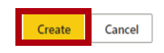
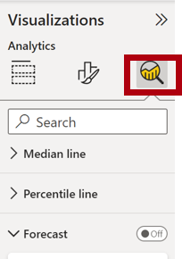

---
lab:
    title: 'Perform Data Analysis in Power BI Desktop'
    module: 'Module 10 - Perform Advanced Analytics'
---

# **Perform Data Analysis in Power BI Desktop**

**The estimated time to complete the lab is 45 minutes**

In this lab you will create the **Sales Exploration** report.

In this lab you learn how to:

- Create animated scatter charts

- Use a visual to forecast values

- Work with the decomposition tree visual

- Work with the key influencers visual

### **Lab story**

This lab is one of many in a series of labs that was designed as a complete story from data preparation to publication as reports and dashboards. You can complete the labs in any order. However, if you intend to work through multiple labs, for the first 10 labs, we suggest you do them in the following order:

1. Prepare Data in Power BI Desktop

2. Load Data in Power BI Desktop

3. Model Data in Power BI Desktop, Part 1

4. Model Data in Power BI Desktop, Part 2

5. Create DAX Calculations in Power BI Desktop, Part 1

6. Create DAX Calculations in Power BI Desktop, Part 2

7. Design a Report in Power BI Desktop, Part 1

8. Design a Report in Power BI Desktop, Part 2

9. Create a Power BI Dashboard

10. Create a Power BI Paginated Report

11. **Perform Data Analysis in Power BI Desktop**

12. Enforce Row-Level Security

## **Exercise 1: Create the Report**

In this exercise you will create the **Sales Exploration** report.

### **Task 1: Get started – Sign in**

In this task you will setup the environment for the lab by signing in to Power BI.

*Important: If you have already signed in to Power BI in a previous lab, continue from the next task.*

1. To open Microsoft Edge, on the taskbar, click the Microsoft Edge program shortcut.

 	

1. In the Microsoft Edge browser window, navigate to **https://powerbi.com**.

 	*Tip: You can also use the Power BI Service favorite on the Microsoft Edge favorites bar.*

1. Click **Sign In** (located at the top-right corner).

 	

1. Enter the account details provided to you.

1. If prompted to update the password, reenter the provided password, and then enter and confirm a new password.

 	*Important: Be sure to record your new password.*

1. Complete the sign in process.

1. If prompted by Microsoft Edge to stay signed in, click **Yes**.

1. In the Microsoft Edge browser window, in the Power BI service, in the **Navigation** pane, expand **My Workspace**.

 	

1. Leave the Microsoft Edge browser window open.

### **Task 2: Get started – Create a dataset**

In this task you will setup the environment for the lab by creating a dataset.

*Important: If you have already published the dataset in the **Create a Power BI Dashboard** lab, continue from the next task.*

1. In the Microsoft Edge browser window, in the Power BI service, in the **Navigation** pane, at the bottom, click **Get Data**.

	

2. In the **Files** tile, click **Get**.

	

3. Click the **Local File** tile.

	

4. In the **Open** window, navigate to the **D:\DA100\Labs\09-create-power-bi-dashboard\Solution** folder.

5. Select the **Sales Analysis.pbix** file, and then click **Open**.

6. If prompted to replace the dataset, click **Replace**.

### **Task 3: Create the report**

In this task you will create the **Sales Exploration** report.

1. To open the Power BI Desktop, on the taskbar, click the Microsoft Power BI Desktop shortcut.

	*Important: If you already have Power BI Desktop open (from a previous lab), close that instance.*

	

2. To close the getting started window, at the top-left of the window, click **X**.

	

3. If Power BI Desktop is not signed in to the Power BI service, at the top-right, click **Sign In**.

	

4. Complete the sign in process using the same account used to sign in to the Power BI service.

5. To save the file, click the **File** ribbon tab to open the backstage view.

6. Select **Save**.

	

7. In the **Save As** window, navigate to the **D:\DA100\MySolution** folder.

8. In the **File Name** box, enter **Sales Exploration**.

	

9. To create a live connection to the **Sales Analysis** dataset, on the **Home** ribbon tab, from inside the **Data** group, click **Power BI Datasets**.

	

10. In the **Select a Dataset to Create a Report** window, select the **Sales Analysis** dataset.

11. Click **Create**.

	

12. Save the Power BI Desktop file.

	*You’ll now create four report pages, and on each page you’ll work with a different visual to analyze and explore data.*

## **Exercise 2: Create a Scatter Chart**

In this exercise you will create a scatter chart that can be animated.

### **Task 1: Create an animated scatter chart**

In this task you will create a scatter chart that can be animated.

1. Rename **Page 1** as **Scatter Chart**.

	

2. Add a **Scatter Chart** visual to the report page, and then position and resize it so it fills the entire page.

	

	

3. Add the following fields to the visual wells/areas:

	The labs use a shorthand notation to reference a field. It will look like this: **Reseller** **\|** **Business Type**. In this example, **Reseller** is the table name and **Business Type** is the field name.

	- Legend: **Reseller \| Business Type**

	- X Axis: **Sales \| Sales** 

	- Y Axis: **Sales \| Profit Margin**

	- Size: **Sales \| Quantity**

	- Play Axis: **Date \| Quarter**

	

	*The chart can be animated when a field is added to the **Play Axis** well/area.*

4. In the **Filters** pane, add the **Product \| Category** field to the **Filters On This Page** well/area.

5. In the filter card, filter by **Bikes**.

	

6. To animate the chart, at the bottom left corner, click **Play**.

	

7. Watch the entire animation cycle from **FY2018 Q1** to **FY2020 Q4**.

	*The scatter chart allows understanding the measure values simultaneously: in this case, order quantity, sales revenue, and profit margin.*

	*Each bubble represents a reseller business type. Changes in the bubble size reflect increased or decreased order quantities. While horizontal movements represent increases/decreases in sales revenue, and vertical movements represent increases/decreases in profitability.*

8. When the animation stops, click one of the bubbles to reveal its tracking over time.

9. Hover the cursor over any bubble to reveal a tooltip describing the measure values for the reseller type at that point in time.

10. In the **Filters** pane, filter by **Clothing** only, and notice that it produces a very different result.

11. Save the Power BI Desktop file.

## **Exercise 3: Create a Forecast**

In this exercise you will create a forecast to determine possible future sales revenue.

### **Task 1: Create a forecast**

In this task you will create a forecast to determine possible future sales revenue.

1. Add a new page, and then rename the page to **Forecast**.

	

2. Add a **Line Chart** visual to the report page, and then position and resize it so it fills the entire page.

	

	

  

3. Add the following fields to the visual wells/areas:

	- Axis: **Date \| Date**

	- Values: **Sales \| Sales** 

	

4. In the **Filters** pane, add the **Date \| Year** field to the **Filters On This Page** well/area.

5. In the filter card, filter by two years: **FY2019** and **FY2020**.

	

	*When forecasting over a time line, you will need at least two cycles (years) of data to produce an accurate and stable forecast.*

  

6. Add also the **Product \| Category** field to the **Filters On This Page** well/area, and filter by **Bikes**.

	

7. To add a forecast, beneath the **Visualizations** pane, select the **Analytics** pane.

	

8. Expand the **Forecast** section.

	

	*If the **Forecast** section is not available, it’s probably because the visual hasn’t been correctly configured. Forecasting is only available when two conditions are met: the axis has a single field of type date, and there’s only one value field.*

9. Click **Add**.

	

10. Configure the following forecast properties:

	- Forecast length: 1 month

	- Confidence interval: 80%

	- Seasonality: 365

11. Click **Apply**.

	

12. In the line visual, notice that the forecast has extended one month beyond the history data.

	*The gray area represents the confidence. The wider the confidence, the less stable—and therefore the less accurate—the forecast is likely to be.*

	*When you know the length of the cycle, in this case annual, you should enter the seasonality points. Sometimes it could be weekly (7), or monthly (30).*

13. In the **Filters** pane, filter by **Clothing** only, and notice that it produces a different result.

14. Save the Power BI Desktop file.

## **Exercise 4: Work with a Decomposition Tree**

In this exercise you will create a decomposition tree to explore the relationships between reseller geography and profit margin.

### **Task 1: Work with a decomposition tree**

In this task you will create a decomposition tree to explore the relationships between reseller geography and profit margin.

1. Add a new page, and then rename the page to **Decomposition Tree**.

	

2. On the **Insert** ribbon, from inside the **AI Visuals** group, click **Decomposition Tree**.

	*Tip: The AI visuals are also available in the **Visualizations** pane.*

	

3. Position and resize the visual so it fills the entire page.

	

4. Add the following fields to the visual wells/areas:

	- Analyze: **Sales \| Profit Margin**

	- Explain By: **Reseller \| Geography** (the entire hierarchy)

	

5. In the **Filters** pane, add the **Date \| Year** field to the **Filters On This Page**, and set the filter to **FY2020**.

	

6. In the decomposition tree visual, notice the root of the tree: **Profit Margin** at -0.94%

	

7. Click the plus icon, and in the context menu, select **High Value**.

	

8. Notice that the decomposition tree presents resellers, ordered from highest profit margin.

9. To remove the level, at the top of visual, beside the **Reseller** label, click **X**.

	

10. Click the plus icon again, and then expand to the **Country-Region** level.

11. Expand from the **United States** to the **State-Province** level.

12. Use the down-arrow located at the bottom of the visual for **State-Province**, and then scroll to the lower profitable states.

13. Notice that **New York** state has negative profitability.

14. Expand from **New York** to the **Reseller** level.

15. Notice that it is easy to isolate root cause.

	

	***United States** is not producing profit in **FY2020**. **New York** is one state that’s not achieving positive profit, and it’s due to four resellers paying less than standard costs for their goods.*

16. Save the Power BI Desktop file.

## **Exercise 5: Work with Key Influencers**

In this exercise you will use the Key Influencers AI visual to determine what influences profitability within reseller business types and geography.

### **Task 1: Work with key influencers**

In this task you will use the Key Influencers AI visual to determine what influences profitability within reseller business types and geography.

1. Add a new page, and then rename the page to **Key Influencers**.

	

2. On the **Insert** ribbon, from inside the **AI Visuals** group, click **Key Influencers**.

	*Tip: The AI visuals are also available in the **Visualizations** pane.*

	

3. Position and resize the visual so it fills the entire page.

	

4. Add the following fields to the visual wells:

	- Analyze: **Sales \| Profit Margin**

	- Explain By: **Reseller \| Business Type** and **Reseller \| Geography** (the entire hierarchy)

	- Expand By: **Sales \| Quantity**

	

5. At the top-left of the visual, notice that **Key Influencers** is in focus, and the specific influence is set to understand what influences profit margin to increase.

	

6. Review the result, which is that the city of **Bothell** is more likely to increase.

7. Modify the target to determine what influences profit margin to decrease.

	

8. Review the result.

9. To detect segments, at the top-left, select **Top Segments**.

	

10. Notice that the target is now to determine segments when profit margin is likely to be high.

11. When the visual displays the segments (as circles), click one of them to reveal information about it.

12. Review the segment results.

### **Task 2: Finish up**

In this task you will complete the lab.

1. Select the **Scatter Chart** page.

2. Save the Power BI Desktop file.

3. To publish the file to your workspace, on the **Home** ribbon tab, from inside the **Share** group, click **Publish**.

	

4.  Close Power BI Desktop.
