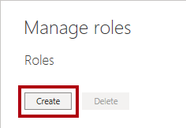
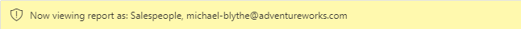

---
lab:
    title: 'Enforce Row-Level Security'
    module: 'Module 13 - Row-Level Security'
---

# **Enforce Row-Level Security**

**The estimated time to complete the lab is 45 minutes**

In this lab you will create a many-to-many relationship between the **Salesperson** table and the **Sales** table. You will also enforce row-level security to ensure that a salesperson can only analyze sales data for their assigned region(s).

In this lab you learn how to:

- Configure many-to-many relationships

- Enforce row-level security

### **Lab story**

This lab is one of many in a series of labs that was designed as a complete story from data preparation to publication as reports and dashboards. You can complete the labs in any order. However, if you intend to work through multiple labs, for the first 10 labs, we suggest you do them in the following order:

1. Prepare Data in Power BI Desktop

2. Load Data in Power BI Desktop

3. Model Data in Power BI Desktop, Part 1

4. Model Data in Power BI Desktop, Part 2

5. Create DAX Calculations in Power BI Desktop, Part 1

6. Create DAX Calculations in Power BI Desktop, Part 2

7. Design a Report in Power BI Desktop, Part 1

8. Design a Report in Power BI Desktop, Part 2

9. Create a Power BI Dashboard

10. Perform Data Analysis in Power BI Desktop

11. Create a Power BI Paginated Report

12. **Enforce Row-Level Security**

## **Exercise 1: Enforce row-level security**

In this exercise you will enforce row-level security to ensure a salesperson can only ever see sales made in their assigned region(s).

### **Task 1: Get started**

In this task you will setup the environment for the lab.

*Important: If you are continuing on from the previous lab (and you completed that lab successfully), do not complete this task; instead, continue from the next task.*

1. To open the Power BI Desktop, on the taskbar, click the Microsoft Power BI Desktop shortcut.

	

1. To close the getting started window, at the top-left of the window, click **X**.

	

1. To open the starter Power BI Desktop file, click the **File** ribbon tab to open the backstage view.

1. Select **Open Report**.

	

1. Click **Browse Reports**.

	

1. In the **Open** window, navigate to the **D:\DA100\Labs\12-row-level-security\Starter** folder.

1. Select the **Sales Analysis** file.

1. Click **Open**.

	

1. Close any informational windows that may open.

1. To create a copy of the file, click the **File** ribbon tab to open the backstage view.

1. Select **Save As**.

	

1. If prompted to apply changes, click **Apply**.

	

1. In the **Save As** window, navigate to the **D:\DA100\MySolution** folder.

1. Click **Save**.

	

### **Task 2: Enforce row-level security**

In this task you will enforce row-level security to ensure a salesperson can only see sales made in their assigned region(s).

1. Switch to Data view.

	

2. In the **Fields** pane, select the **Salesperson (Performance)** table.

3. Review the data, noticing that Michael Blythe (EmployeeKey 281) has a UPN value of: **michael-blythe@adventureworks.com**

	*Recall that Michael Blythe is assigned to three sales regions: US Northeast, US Central, and US Southeast.*

4. Switch to Report view.

5. On the **Modeling** ribbon tab, from inside the **Security** group, click **Manage Roles**.

	

6. In the **Manage Roles** window, click **Create**.

	

7. In the box, replace the selected text with the name of the role: **Salespeople**, and then press **Enter**.

	

8. To assign a filter, for the **Salesperson (Performance)** table, click the ellipsis (…) character, and then select **Add Filter \| [UPN]**.

	

9. In the **Table Filter DAX Expression** box, modify the expression by replacing **“Value”** with **USERPRINCIPALNAME()**.

	

	*USERPRINCIPALNAME() is a Data Analysis Expressions (DAX) function that returns the name of the authenticated user. It means that the **Salesperson (Performance)** table will filter by the User Principal Name (UPN) of the user querying the model.*

10. Click **Save**.

	

11. To test the security role, on the **Modeling** ribbon tab, from inside the **Security** group, click **View As**.

	

12. In the **View as Roles** window, check the **Other User** item, and then in the corresponding box, enter: **michael-blythe@adventureworks.com**

13. Check the **Salespeople** role.

	

	*This configuration results in using the **Salespeople** role and impersonating the user with your Michael Blythe’s name.*

14. Click **OK**.

	

15. Notice the yellow banner above the report page, describing the test security context.

	

16. In the table visual, notice that only the salesperson **Michael Blythe** is listed.

	

17. To stop testing, at the right side of the yellow banner, click **Stop Viewing**.

	

	*When the Power BI Desktop file is published to the Power BI service, you’ll need to complete a post-publication task to map security principals to the **Salespeople** role. You won’t do that in this lab.*

18. To delete the role, on the **Modeling** ribbon tab, from inside the **Security** group, click **Manage Roles**.

	

19. In the **Manage Roles** window, click **Delete**.

	

20. When prompted to confirm the deletion, click **Yes, Delete**.

21. Click **Save**.

	

### **Task 2: Finish up**

In this task you will complete the lab.

1. Save the Power BI Desktop file.
