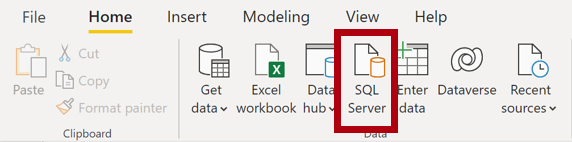
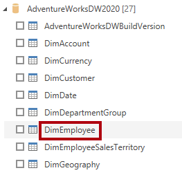
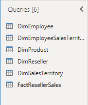
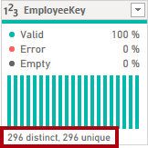

---
lab:
    course: 'PL-300, DP-605'
    title: 'Get Data in Power BI Desktop'
    module: 'Get Data in Power BI'
---

# Get Data in Power BI Desktop

## **Lab story**

This lab is designed to introduce you to Power BI Desktop application and how to connect to data and how to use data preview techniques to understand the characteristics and quality of the source data. The learning objectives are:

- Open Power BI Desktop
- Connect to different data sources
- Preview source data with Power Query
- Use data profiling features in Power Query

**This lab should take approximately 30 minutes.**

## **Get started with Power BI Desktop**

 In this task, you start by opening a starter Power BI (.pbix) file. The starter file doesn't contain any data, but has been specially configured to help you complete the lab. The following report-level settings have been disabled in the starter file:

- Data Load > Import relationships from data sources on first load
- Data Load > Autodetect new relationships after data is loaded

*Note: While having these two options enabled can be helpful when developing a data model, you disabled them earlier to support the lab experience. When you create relationships in the **Load Transformed Data in Power BI Desktop** lab, you’ll learn why you're adding each one.*

1. Open Power BI Desktop.

    

    *Tip: By default, the Getting Started dialog box opens in front of Power BI Desktop. You can choose to sign-in, and then close the pop-up.*

1. To open the starter Power BI Desktop file, select the **File > Open Report > Browse Reports**.

1. In the **Open** window, navigate to the **D:\Allfiles\Labs\01-prepare-data-with-power-query-in-power-bi-desktop\Starter** folder.

1. Select the **Sales Analysis** file.

1. Save a copy of the file with **Save As** in to the **D:\Allfiles\MySolution** folder.

## **Get data from SQL Server**

This task teaches you how to connect to a SQL Server database and import tables, which create queries in Power Query.

1. On the **Home** ribbon tab, from inside the **Data** group, select **SQL Server**.

     

1. In the **SQL Server Database** window, in the **Server** box, enter **localhost** and leave **Database** blank, then select **OK**.

    *Note: In this lab, you’ll connect to the SQL Server database by using **localhost** because gateway data sources can't resolve **localhost**. This isn’t a recommended practice when creating your own solutions.*

1. If prompted for credentials, in the **SQL Server Database** window, select **Use my current credentials**, and then **Connect**.

1. In the **Navigator** pane, expand the **AdventureWorksDW2020** database.

    *Note: The **AdventureWorksDW2020** database is based on the **AdventureWorksDW2017** sample database. It has been modified to support the learning objectives of the course labs.*

1. Select the **DimEmployee** table, and notice the preview of the table data.

     

    *Note: The preview data allows you to see the columns and a sample of rows.*

1. To import the table data, **select the checkbox** next to the following six tables:

    - DimEmployee
    - DimEmployeeSalesTerritory
    - DimProduct
    - DimReseller
    - DimSalesTerritory
    - FactResellerSales

1. Complete this task by selecting **Transform Data**, which will open Power Query Editor.

You've now imported data into Power BI and have the Power Query Editor open for the next task.

## **Preview Data in Power Query Editor**

This task introduces the Power Query Editor and allows you to review and profile the data. This helps you determine how to clean and transform the data later. You'll also review both dimension tables prefixed with "Dim" and fact tables prefixed with "Fact".

1. In the **Power Query Editor** window, at the left, notice the **Queries** pane. The **Queries** pane contains one query for each table you checked.

     

1. Select the first query—**DimEmployee**.

    *The **DimEmployee** table in the SQL Server database stores one row for each employee. A subset of the rows from this table represents the salespeople, which will be relevant to the model you’ll develop.*

1. At the bottom left corner of the status bar, some table statistics are provided—the table has 33 columns, and 296 rows.

     

1. In the data preview pane, scroll horizontally to review all columns. Notice that the last five columns contain **Table** or **Value** links.

    *These five columns represent relationships to other tables in the database. They can be used to join tables together. You’ll join tables in the **Load Transformed Data in Power BI Desktop** lab.*

1. To assess column quality, on the **View** ribbon tab, from inside the **Data Preview** group, check **Column Quality**. The column quality feature allows you to easily determine the percentage of valid, error, or empty values found in columns.

     

1. Notice that the **Position** column has 94% empty (null) rows.

     

1. To assess column distribution, on the **View** ribbon tab, from inside the **Data Preview** group, check **Column Distribution**.

1. Review the **Position** column again, and notice that there are four distinct values, and one unique value.

1. Review the column distribution for the **EmployeeKey** column—there are 296 distinct values, and 296 unique values.

    *When the distinct and unique counts are the same, it means the column contains unique values. When modeling, it’s important that some model tables have unique columns. These unique columns can be used to create one-to-many relationships, which you'll do in the **Model Data in Power BI Desktop** lab.*

     

1. In the **Queries** pane, select the **DimProduct** query.

    *The **DimProduct** table contains one row per product sold by the company.*

1. In the **Queries** pane, select the **DimReseller** query.

    *The **DimReseller** table contains one row per reseller. Resellers sell, distribute, or value add to the Adventure Works products.*

1. To view column values, on the **View** ribbon tab, from inside the **Data Preview** group, check **Column Profile**.

1. Select the **BusinessType** column header, and notice the new pane beneath the data preview pane.

1. Review the column statistics and value distribution in the data preview pane.

    *Notice the data quality issue: there are two labels for warehouse (**Warehouse**, and the misspelled **Ware House**).*

     

1. Hover the cursor over the **Ware House** bar, and notice that there are five rows with this value.

    *You’ll apply a transformation to relabel these five rows in the **Load Transformed Data in Power BI Desktop** lab.*

1. In the **Queries** pane, select the **DimSalesTerritory** query.  

    *The **DimSalesTerritory** table contains one row per sales region, including **Corporate HQ** (headquarters). Regions are assigned to a country, and countries are assigned to groups. In the **Model Data in Power BI Desktop** lab, you’ll create a hierarchy to support analysis at region, country, or group level.*

1. In the **Queries** pane, select the **FactResellerSales** query.

    *The **FactResellerSales** table contains one row per sales order line—a sales order contains one or more line items.*

1. Review the column quality for the **TotalProductCost** column, and notice that 8% of the rows are empty.

    *Missing **TotalProductCost** column values is a data quality issue. To address the issue, in the **Load Transformed Data in Power BI Desktop** lab, you’ll apply transformations to fill in missing values by using the product standard cost, which is stored in the related **DimProduct** table.*

## **Get data from a CSV file**

In this task, you'll create a new query based on CSV files.

1. To add a new query, in the **Power Query Editor** window, on the **Home** ribbon tab, from inside the **New Query** group, select the **New Source** down-arrow, and then select **Text/CSV**.

1. In the **Open** window, navigate to the **D:\Allfiles\Resources** folder, and select the **ResellerSalesTargets.csv** file. Select **Open**.

1. In the **ResellerSalesTargets.csv** window, review the preview data. Select **OK**.

1. In the **Queries** pane, notice the addition of the **ResellerSalesTargets** query.

    *The **ResellerSalesTargets** CSV file contains one row per salesperson, per year. Each row records 12 monthly sales targets (expressed in thousands). The business year for the Adventure Works company commences on July 1.*

1. Notice that no column contains empty values.  When there isn’t a monthly sales target, a hyphen character is stored instead.

1. Review the icons in each column header, to the left of the column name. The icons represent the column data type. **123** is whole number, and **ABC** is text.

     

1. Repeat the steps to create a query based on the **D:\Allfiles\Resources\ColorFormats.csv** file.

    *The **ColorFormats** CSV file contains one row per product color. Each row records the HEX codes to format background and font colors.*

*You should now have two new queries, **ResellerSalesTargets** and **ColorFormats**.*

 

### **Finish up**

In this task, you'll complete the lab.

1. On the **View** ribbon tab, from inside the **Data Preview** group, uncheck the three data preview options that were previously enabled in this lab:

    - Column quality
    - Column distribution
    - Column profile

     

1. **Save** the Power BI Desktop file. When prompted to apply the pending changes, select **Apply Later**.

    *Tip: Applying the queries will load their data to the data model. You’re not ready to do that, as there are many transformations that must be applied first.*
