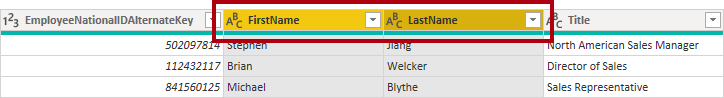
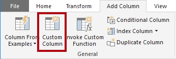
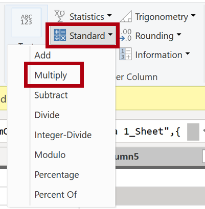
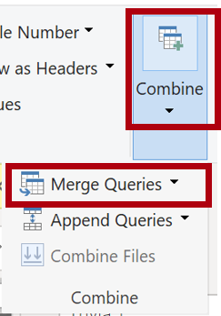
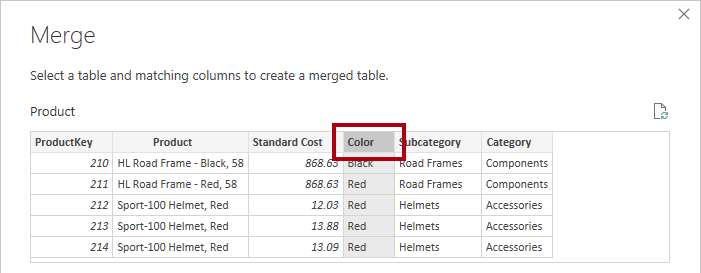
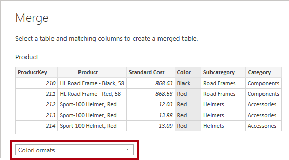
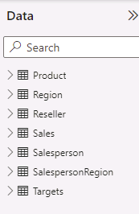

---
lab:
    course: 'PL-300, DP-605'
    title: 'Load Transformed Data in Power BI Desktop'
    module: 'Clean, Transform, and Load Data in Power BI'
---

# Load Transformed Data in Power BI Desktop

## **Lab story**

In this lab, you'll use data cleansing and transformation techniques to start shaping your data model. You'll then apply the queries to load each as a table to the data model.

In this lab you learn how to:

- Apply various transformations
- Load queries to the data model

**This lab should take approximately 45 minutes.**

## **Get started**

In this task, you'll set up the environment for the lab.

*Important: If you completed the previous lab in the same VM, skip to the next task.*

1. Open Power BI Desktop.

	*Tip: By default, the Getting Started dialog box opens in front of Power BI Desktop. You can choose to sign-in, and then close the pop-up.*

    

1. To open the starter Power BI Desktop file, select the **File > Open Report > Browse Reports**.

1. In the **Open** window, navigate to the **D:\Allfiles\Labs\02-load-data-with-power-query-in-power-bi-desktop\Starter** folder, and open the **Sales Analysis** file.

1. Close any informational windows that may open.

1. Notice the warning message beneath the ribbon.

	*This message alerts you to the fact that the queries haven't been applied to load as model tables. You’ll apply the queries later in this lab.*

	To dismiss the warning message, at the right of the warning message, select **X**.

1. To create a copy of the file, go to **File > Save As** and save to **D:\Allfiles\MySolution** folder.

1. If prompted to apply changes, select **Apply Later**.

## **Configure the Salesperson query**

In this task, you'll use Power Query Editor to configure the **Salesperson** query.

*Important: When instructed to rename columns, it’s important that you rename them exactly as described.*

1. To open the **Power Query Editor** window, on the **Home** ribbon tab, from inside the **Queries** group, select the **Transform Data** icon.

     

1. In the **Power Query Editor** window, in the **Queries** pane, select the **DimEmployee** query.

     

1. To rename the query, in the **Query Settings** pane (located at the right), in the **Name** box, replace the text with **Salesperson**, and then press **Enter**. Then verify the name has been updated in **Queries** pane.

	*The query name determines the model table name. It’s recommended to define concise and user-friendly names.*

1. To locate a specific column, on the **Home** ribbon tab, select the **Manage Columns** down-arrow, select the **Choose Columns** down-arrow, and then select **Go to Column**.

	*Go to Column is a useful feature with many columns. Otherwise, you can horizontally scroll find columns.*

     

1. In the **Go to Column** window, to order the list by column name, select the **AZ** sort button, and then select **Name** and **SalesPersonFlag**. Click **OK**.

     

1. Locate the **SalesPersonFlag** column, then filter the column to select only Salespeople (that is, **TRUE**), and click **OK**.

1. In the **Query Settings** pane, in the **Applied Steps** list, notice the addition of the **Filtered Rows** step.

	*Each transformation you create results in another step logic. It’s possible to edit or delete steps. It’s also possible to select a step to preview the query results at that stage of the query transformation.*

     

1. To remove columns, on the **Home** ribbon tab, select the **Manage Columns** group, select the **Choose Columns** icon.

1. In the **Choose Columns** window, to uncheck all columns, uncheck the **(Select All Columns)** item.

1. To include columns, check the following six columns:

    - EmployeeKey
    - EmployeeNationalIDAlternateKey
    - FirstName
    - LastName
    - Title
    - EmailAddress

1. In the **Applied Steps** list, notice the addition of another query step.

     

1. To create a single name column, first select the **FirstName** column header. While pressing the **Ctrl** key, select the **LastName** column.

     

1. Right-click either of the select column headers, and then in the context menu, select **Merge Columns**.

	*Many common transformations can be applied by right-clicking the column header, and then choosing them from the context menu. Note, however, more transformations are available in the ribbon.*

1. In the **Merge Columns** window, in the **Separator** dropdown list, select **Space**.

1. In the **New Column Name** box, replace the text with **Salesperson**.

1. To rename the **EmployeeNationalIDAlternateKey** column, double-click the **EmployeeNationalIDAlternateKey** column header and replace the text with **EmployeeID**, and then press **Enter**.

1. Use the previous steps to rename the **EmailAddress** column to **UPN**.

	*UPN is an acronym for User Principal Name.*

1. At the bottom-left, in the status bar, verify that the query has five columns and 18 rows.

## **Configure the SalespersonRegion query**

In this task, you'll configure the **SalespersonRegion** query.

1. In the **Queries** pane, select the **DimEmployeeSalesTerritory** query.

1. In the **Query Settings** pane, rename the query to **SalespersonRegion**.

1. To remove the last two columns, first select the **DimEmployee** column header.

1. While pressing the **Ctrl** key, select the **DimSalesTerritory** column header.

1. Right-click either of the select column headers, and then in the context menu, select **Remove Columns**.

1. In the status bar, verify that the query has two columns and 39 rows.

## **Configure the Product query**

In this task, you'll configure the **Product** query.

*Important: When detailed instructions have already been provided, lab steps will provide more concise instructions. If you need the detailed instructions, you can refer back to the steps of previous tasks.*

1. Select the **DimProduct** query and rename the query to **Product**.

1. Locate the **FinishedGoodsFlag** column, and then filter the column to retrieve products that are finished goods (that is, TRUE).

1. Remove all columns, **except** the following:

    - ProductKey
    - EnglishProductName
    - StandardCost
    - Color
    - DimProductSubcategory

1. Notice that the **DimProductSubcategory** column represents a related table (it contains **Value** links).

1. In the **DimProductSubcategory** column header, at the right of the column name, select the expand button.

    

1. See the full list of columns, then select the **Select All Columns** box to unselect all columns.
2. Select **EnglishProductSubcategoryName** and **DimProductCategory**, and uncheck the **Use Original Column Name as Prefix** checkbox before selecting **OK**.

	*By selecting these two columns, a transformation will be applied to join to the **DimProductSubcategory** table, and then include these columns. The **DimProductCategory** column is, in fact, another related table in the data source.*

	*Query column names must always be unique. If left checked, this checkbox would prefix each column with the expanded column name (in this case **DimProductSubcategory**). Because it’s known that the selected column names don’t collide with column names in the **Product** query, the option is deselected.*

1. Notice that the transformation resulted in the addition of two columns, and that the **DimProductSubcategory** column has been removed.

1. Expand the **DimProductCategory** column, and then introduce only the **EnglishProductCategoryName** column.

1. Rename the following four columns:

    - **EnglishProductName** to **Product**
    - **StandardCost** to **Standard Cost** (include a space)
    - **EnglishProductSubcategoryName** to **Subcategory**
    - **EnglishProductCategoryName** to **Category**

1. In the status bar, verify that the query has six columns and 397 rows.

## **Configure the Reseller query**

In this task, you'll configure the **Reseller** query.

1. Select the **DimReseller** query and rename to **Reseller**.

1. Remove all columns, **except** the following:

    - ResellerKey
    - BusinessType
    - ResellerName
    - DimGeography

1. Expand the **DimGeography** column, to include **only** the following three columns:

    - City
    - StateProvinceName
    - EnglishCountryRegionName

1. On the **Business Type** column header, select the down-arrow, and then review the distinct column values, and notice both values **Warehouse** and **Ware House**.

1. Right-click the **Business Type** column header, and then select **Replace Values**.

1. In the **Replace Values** window, configure the following values:

    - In the **Value to Find** box, enter **Ware House**
    - In the **Replace With** box, enter **Warehouse**

     

1. Rename the following four columns:

    - **BusinessType** to **Business Type** (include a space)
    - **ResellerName** to **Reseller**
    - **StateProvinceName** to **State-Province**
    - **EnglishCountryRegionName** to **Country-Region**

1. In the status bar, verify that the query has six columns and 701 rows.

## **Configure the Region query**

In this task, you'll configure the **Region** query.

1. Select the **DimSalesTerritory** query and rename the query to **Region**.

1. Apply a filter to the **SalesTerritoryAlternateKey** column to remove the value 0 (zero).

	*This will remove one row.*

1. Remove all columns, **except** the following:

    - SalesTerritoryKey
    - SalesTerritoryRegion
    - SalesTerritoryCountry
    - SalesTerritoryGroup

1. Rename the following three columns:

    - **SalesTerritoryRegion** to **Region**
    - **SalesTerritoryCountry** to **Country**
    - **SalesTerritoryGroup** to **Group**

1. In the status bar, verify that the query has four columns and 10 rows.

## **Configure the Sales query**

In this task, you'll configure the **Sales** query.

1. Select the **FactResellerSales** query and rename it to **Sales**.

1. Remove all columns, **except** the following:

    - SalesOrderNumber
    - OrderDate
    - ProductKey
    - ResellerKey
    - EmployeeKey
    - SalesTerritoryKey
    - OrderQuantity
    - UnitPrice
    - TotalProductCost
    - SalesAmount
    - DimProduct

		*Note: You may recall in the **Prepare Data in Power BI Desktop** lab that a small percentage of **FactResellerSales** rows had missing **TotalProductCost** values. The **DimProduct** column has been included to retrieve the product standard cost column to assist fixing the missing values.*

1. Expand the **DimProduct** column, uncheck all columns, and then include only the **StandardCost** column.

1. To create a custom column, on the **Add Column** ribbon tab, from inside the **General** group, select **Custom Column**.

     

1. In the **Custom Column** window, in the **New Column Name** box, replace the text with **Cost**.

1. In the **Custom Column Formula** box, enter the following expression (after the equals symbol), then save the new column:

   ` if [TotalProductCost] = null then [OrderQuantity] * [StandardCost] else [TotalProductCost] `

    *You can copy the expression from the **D:\Allfiles\Labs\02-load-data-with-power-query-in-power-bi-desktop\Assets\Snippets.txt** file.*

    *This expression tests if the **TotalProductCost** value is missing. If missing, it produces a value by multiplying the **OrderQuantity** value by the **StandardCost** value; otherwise, it uses the existing **TotalProductCost** value.*

1. Remove the following two columns:

    - TotalProductCost
    - StandardCost

1. Rename the following three columns:

    - **OrderQuantity** to **Quantity**
    - **UnitPrice** to **Unit Price** (include a space)
    - **SalesAmount** to **Sales**

1. To modify the column data type, in the **Quantity** column header, at the left of the column name, select the **1.2** icon, and then select **Whole Number**.

	*Configuring the correct data type is important. When the column contains numeric value, it’s also important to choose the correct type if you expect to perform mathematic calculations.*

     

1. Modify the following three column data types to **Fixed Decimal Number**.

	*The fixed decimal number data type allows for 19 digits, and allows for more precision to avoid rounding errors. It’s important to use the fixed decimal number type for financial values, or rates (like exchange rates).*

    - Unit Price
    - Sales
    - Cost

1. In the status bar, verify that the query has 10 columns and 999+ rows.

	*A maximum of 1000 rows will be loaded as preview data for each query.*

## **Configure the Targets query**

In this task, you'll configure the **Targets** query.

1. Select the **ResellerSalesTargets** query and rename to **Targets**.

1. To unpivot the 12 month columns (**M01**-**M12**), first multi-select the **Year** and **EmployeeID** column headers.

1. Right-click either of the select column headers, and then in the context menu, select **Unpivot Other Columns**.

1. Notice that the column names now appear in the **Attribute** column, and the values appear in the **Value** column.

1. Apply a filter to the **Value** column to remove hyphen (-) values.

	*You may recall that the hyphen character was used in the source CSV file to represent zero (0).*

1. Rename the following two columns:

    - **Attribute** to **MonthNumber** (there's no space)
    - **Value** to **Target**

1. To prepare the **MonthNumber** column values, right-click the **MonthNumber** column header, and then select **Replace Values**.

	*You’ll now apply transformations to produce a date column. The date will be derived from the **Year** and **MonthNumber** columns. You’ll create the column by using the **Columns From Examples** feature.*

1. In the **Replace Values** window, in the **Value To Find** box, enter **M** and leave the **Replace with** empty.

1. Modify the **MonthNumber** column data type to **Whole Number**.

1. On the **Add Column** ribbon tab, from inside the **General** group, select The **Column From Examples** icon.

    

1. Notice that the first row is for year **2017** and month number **7**.

1. In the **Column1** column, in the first grid cell, commence entering **7/1/2017**, and then press **Enter**.

	*The virtual machine uses US regional settings, so this date is in fact July 1, 2017. Other regional settings may require a **0** before the date.*

1. Notice that the grid cells update with predicted values.

	*The feature has accurately predicted that you're combining values from the **Year** and **MonthNumber** columns.*

1. Notice also the formula presented above the query grid.

     

1. To rename the new column, double-click the **Merged** column header and rename the column as **TargetMonth**.

1. Remove the following columns:

    - Year
    - MonthNumber

1. Modify the following column data types:

    - **Target** as fixed decimal number
    - **TargetMonth** as date

1. To multiply the **Target** values by 1000, select the **Target** column header, and then on the **Transform** ribbon tab, from inside the **Number Column** group, select **Standard**, and then select **Multiply**.

	*You may recall that the target values were stored as thousands.*

     

1. In the **Multiply** window, in the **Value** box, enter **1000**, and select **OK**.

1. In the status bar, verify that the query has three columns and 809 rows.

## **Configure the ColorFormats query**

In this task, you'll configure the **ColorFormats** query.

1. Select the **ColorFormats** query and notice that the first row contains the column names.

1. On the **Home** ribbon tab, from inside the **Transform** group, select **Use First Row as Headers**.

     

1. In the status bar, verify that the query has three columns and 10 rows.

## **Update the Product query**

In this task, you'll update the **Product** query by merging the **ColorFormats** query.

1. Select the **Product** query.

1. To merge the **ColorFormats** query, on the **Home** ribbon tab, select the **Combine** down-arrow, then select **Merge Queries**.

	*Merging queries allows integrating data, in this case from different data sources (SQL Server and a CSV file).*

     

1. In the **Merge** window, in the **Product** query grid, select the **Color** column header.

     

1. Beneath the **Product** query grid, in the dropdown list, select the **ColorFormats** query.

     

1. In the **ColorFormats** query grid, select the **Color** column header.

1. When the **Privacy Levels** window opens, for each of the two data sources, in the corresponding dropdown list, select **Organizational**, then **Save**.

	*Privacy levels can be configured for data source to determine whether data can be shared between sources. Setting each data source as **Organizational** allows them to share data, if necessary. Private data sources can never be shared with other data sources. It doesn’t mean that Private data can't be shared; it means that the Power Query engine can't share data between the sources.*

     

1. In the **Merge** window, use the default **Join Kind** - maintaining the selection of Left Outer and select **OK**.

1. Expand the **ColorFormats** column to include the following two columns:

    - Background Color Format
    - Font Color Format

1. In the status bar, verify that the query now has eight columns and 397 rows.

## **Update the ColorFormats query**

In this task, you'll update the **ColorFormats** to disable its load.

1. Select the **ColorFormats** query.

1. In the **Query Settings** pane, select the **All Properties** link.

     

1. In the **Query Properties** window, uncheck the **Enable Load To Report** checkbox.

	*Disabling the load means it will not load as a table to the data model. This is done because the query was merged with the **Product** query, which is enabled to load to the data model.*

     

### **Finish up**

In this task, you'll complete the lab.

1. Verify that you have eight queries, correctly named as follows:

    - Salesperson
    - SalespersonRegion
    - Product
    - Reseller
    - Region
    - Sales
    - Targets
    - ColorFormats (which won't load to the data model)

1. To load the data model, on the **File** backstage view, select **Close &amp; Apply**.

	*All load-enabled queries are now loaded to the data model.*

     

1. In the **Data** pane (located at the right), notice the seven tables loaded to the data model.

     

1. Save the Power BI Desktop file.

*You’ll configure data model tables and relationships in the **Model Data in Power BI Desktop** lab.*
