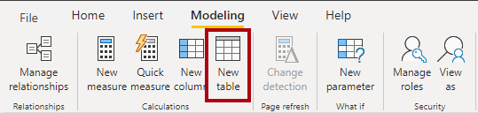
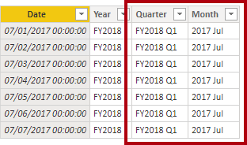
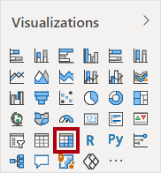
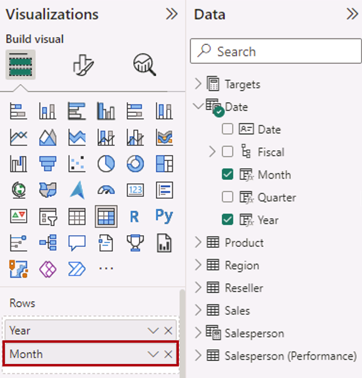
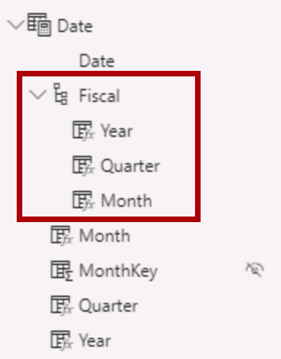
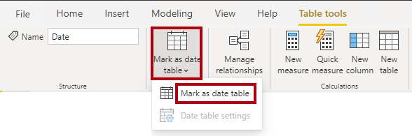
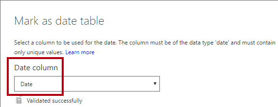
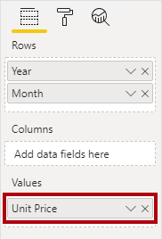
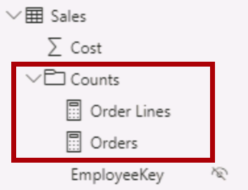
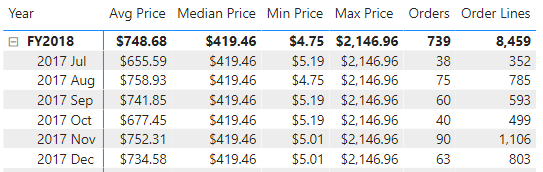

---
lab:
    course: 'PL-300, DP-605'
    title: 'Create DAX Calculations in Power BI Desktop'
    module: 'Create Model Calculations using DAX in Power BI'
---


# Create DAX Calculations in Power BI Desktop

## **Lab story**

In this lab you'll create calculated tables, calculated columns, and simple measures using Data Analysis Expressions (DAX).

In this lab you learn how to:

- Create calculated tables
- Create calculated columns
- Create measures

**This lab should take approximately 45 minutes.**

## **Create Calculated Tables**

In this exercise, you'll create two calculated tables. The first will be the **Salesperson** table, to allow a direct relationship between it and the **Sales** table. The second will be the **Date** table.

*Important: If you're continuing on from the previous lab (and you completed that lab successfully), don't complete this task; instead, continue from the next task.*

1. Open Power BI Desktop.

    

    *Tip: By default, the Getting Started dialog box opens in front of Power BI Desktop. You can choose to sign-in, and then close the pop-up.*

1. To open the starter Power BI Desktop file, select the **File > Open Report > Browse Reports**.

1. In the **Open** window, navigate to the **D:\Allfiles\Labs\04-create-dax-calculations-in-power-bi-desktop\Starter** folder, and open the **Sales Analysis** file.

1. Close any informational windows that may open.

1. Notice the warning message beneath the ribbon.

	*This message alerts you to the fact that the queries haven't been applied to load as model tables. You’ll apply the queries later in this lab.*

	*To dismiss the warning message, at the right of the warning message, select **X**.*

1. To create a copy of the file, go to **File > Save As** and save to **D:\Allfiles\MySolution** folder.

1. If prompted to apply changes, select **Apply Later**.

## **Create the Salesperson table**

In this task, you'll create the **Salesperson** calculated table (direct relationship to **Sales**).

A calculated table is created by first entering the table name, followed by the equals symbol (=), followed by a DAX formula that returns a table. The table name can't already exist in the data model.

The formula bar supports entering a valid DAX formula. It includes features like auto-complete, Intellisense and color-coding, enabling you to quickly and accurately enter the formula.

1. In Power BI Desktop, in Report view, on the **Modeling** ribbon, from inside the **Calculations** group, select **New Table**.

     

2. In the formula bar (which opens directly beneath the ribbon when creating or editing calculations), type **Salesperson =**, press **Shift+Enter**, type **'Salesperson (Performance)'**, and then press **Enter**.

	*For your convenience, all DAX definitions in this lab can be copied from the snippets file, located in **D:\Allfiles\Labs\04-create-dax-calculations-in-power-bi-desktop\Assets\Snippets.txt**.*

	 

	 *This table definition creates a copy of the **Salesperson (Performance)** table. It copies the data only, however model properties like visibility, formatting, etc. aren't copied.*

     *Tip: You’re encouraged to enter “white space” (that is, carriage returns and tabs) to write formulas in an intuitive and easy-to-read format—especially when formulas are long and complex. To enter a carriage return, press **Shift+Enter**. “White space” is optional.*

1. In the **Data** pane, notice that the table icon is a shade of blue (denoting a calculated table).

	

	*Note: Calculated tables are defined by using a DAX formula that returns a table. It’s important to understand that calculated tables increase the size of the data model because they materialize and store values. They’re recomputed whenever formula dependencies are refreshed, as will be the case for this data model when new (future) date values are loaded into tables.*

	*Unlike Power Query-sourced tables, calculated tables can’t be used to load data from external data sources. They can only transform data based on what has already been loaded into the data model.*

1. Switch to Model view, and notice that the **Salesperson** table is available (you may need to reset view to find table).

1. Create a relationship from the **Salesperson \| EmployeeKey** column to the **Sales \| EmployeeKey** column.

1. Right-click the inactive relationship between the **Salesperson (Performance)** and **Sales** tables, and then select **Delete**. When prompted to confirm the deletion, select **Yes**.

1. In the **Salesperson** table, multi-select the following columns, and then hide them (set the **Is Hidden** property to **Yes**):

	- EmployeeID
	- EmployeeKey
	- UPN

1. In the model diagram, select the **Salesperson** table.

1. In the **Properties** pane, in the **Description** box, enter: **Salesperson related to Sales**
    
	*You may recall that descriptions appear as tooltips in the **Data** pane when the user hovers their cursor over a table or field.*

1. For the **Salesperson (Performance)** table, set the description to: **Salesperson related to region(s)**

*The data model now provides two alternatives when analyzing salespeople. The **Salesperson** table allows analyzing sales made by a salesperson, while the **Salesperson (Performance)** table allows analyzing sales made in the sales region(s) assigned to the salesperson.*

## **Create the Date table**

In this task, you'll create the **Date** table.

1. Switch to Data view. On the **Home** ribbon tab, from inside the **Calculations** group, select **New Table**.

	

1. In the formula bar, enter the following:

	**DAX**

	```
	Date =  
	CALENDARAUTO(6)
	```

	


	*The CALENDARAUTO() function returns a single-column table consisting of date values. The “auto” behavior scans all data model date columns to determine the earliest and latest date values stored in the data model. It then creates one row for each date within this range, extending the range in either direction to ensure full years of data is stored.*

	*This function can take a single optional argument that is the last month number of a year. When omitted, the value is 12, meaning that December is the last month of the year. In this case, 6 is entered, meaning that June is the last month of the year.*

1. Notice the column of date values.

	

	*The dates shown are formatted using US regional settings (that is, mm/dd/yyyy).*

5. At the bottom-left corner, in the status bar, notice the table statistics, confirming that 1826 rows of data have been generated, which represents five full years’ data.

	

## **Create calculated columns**

In this task, you'll add more columns to enable filtering and grouping by different time periods. You'll also create a calculated column to control the sort order of other columns.

*For your convenience, all DAX definitions in this lab can be copied from the snippets file, located in **D:\Allfiles\Labs\04-create-dax-calculations-in-power-bi-desktop\Assets\Snippets.txt**.*

1. On the **Table Tools** contextual ribbon, from inside the **Calculations** group, select **New Column**.

	

1. In the formula bar, type the following (or copy from the snippets file), and then press **Enter**:


	**DAX**


	```
	Year =
	"FY" & YEAR('Date'[Date]) + IF(MONTH('Date'[Date]) > 6, 1)
	```


	*A calculated column is created by first entering the column name, followed by the equals symbol (=), followed by a DAX formula that returns a single-value result. The column name can't already exist in the table.*

	*The formula uses the date’s year value but adds one to the year value when the month is after June. It’s how fiscal years at Adventure Works are calculated.*

1. Verify that the new column was added.

	

1. Use the snippets file definitions to create the following two calculated columns for the **Date** table:

	- Quarter
	- Month

	

1. To validate the calculations, switch to Report view.

1. To create a new report page, select the plus icon next to Page 1.

	

1. To add a matrix visual to the new report page, in the **Visualizations** pane, select the matrix visual type.

	*Tip: You can hover the cursor over each icon to reveal a tooltip describing the visual type.*

	

1. In the **Data** pane, from inside the **Date** table, drag the **Year** field into the **Rows** well/area.

	

1. Drag the **Month** field into the **Rows** well/area, directly beneath the **Year** field.

	

1. At the top-right of the matrix visual (or bottom, depending on the location of the visual), select the forked-double arrow icon (which will expand all years down one level).

	

1. Notice that the years expand to months, and that the months are sorted alphabetically rather than chronologically.

	

	*By default, text values sort alphabetically, numbers sort from smallest to largest, and dates sort from earliest to latest.*

1. To customize the **Month** field sort order, switch to Data view.

1. Add the **MonthKey** column to the **Date** table.


	**DAX**


	```
	MonthKey =
	(YEAR('Date'[Date]) * 100) + MONTH('Date'[Date])
	```


	*This formula computes a numeric value for each year/month combination.*

1. In Data view, verify that the new column contains numeric values (for example, 201707 for July 2017, etc.).

	

1. Switch back to Report view. In the **Data** pane, ensure that the **Month** field is selected (when selected, it will have a dark gray background).

1. On the **Column Tools** contextual ribbon, from inside the **Sort** group, select **Sort by Column**, and then select **MonthKey**.

	

1. In the matrix visual, notice that the months are now chronologically sorted.

	

## **Complete the Date table**

In this task, you'll complete the design of the **Date** table by hiding a column and creating a hierarchy. You'll then create relationships to the **Sales** and **Targets** tables.

1. Switch to Model view. In the **Date** table, hide the **MonthKey** column (set **Is Hidden** to **Yes**).


1. On the **Data** right side pane, select the **Date** table, right select on the **Year** column, and select **create hierarchy**. 

1. Rename newly created hierarchy to **Fiscal** by right select and **Rename**.


1. Add the follow two remaining fields to the Fiscal hierarchy by selecting them in the **Data** pane, right clicking, selecting **Add to hierarchy** -> **Fiscal**.

	- Quarter
	- Month

	

1. Create the following two model relationships:

	- **Date \| Date** to **Sales \| OrderDate**
	- **Date \| Date** to **Targets \| TargetMonth**

1. Hide the following two columns:

	- Sales \| OrderDate
	- Targets \| TargetMonth

## **Mark the Date table**

In this task, you'll mark the **Date** table as a date table.

1. Switch to Report view. In the **Data** pane, select the **Date** table (not the **Date** field).

1. On the **Table Tools** contextual ribbon, from inside the **Calendars** group, select **Mark as Date Table**, and then select **Mark as Date Table**.

	

1. In the **Mark as Date Table** window, in the **Date Column** dropdown list, select **Date**. Select **OK**.

	

1. Save the Power BI Desktop file.

	*Power BI Desktop now understands that this table defines date (time). It’s important when relying on time intelligence calculations. You’ll work with time intelligence calculations in the **Create Advanced DAX Calculations in Power BI Desktop** lab.*

	*This design approach for a date table is suitable when you don’t have a date table in your data source. If you have a data warehouse, it would be appropriate to load date data from its date dimension table rather than “redefining” date logic in your data model.*

## **Create simple measures**

In this task, you'll create simple measures. Simple measures aggregate values in a single column or count rows of a table.

1. In Report view, on **Page 2**, in the **Data** pane, drag the **Sales \| Unit Price** field into the matrix visual.

	*The labs use a shorthand notation to reference a field. It will look like this: **Sales \| Unit Price**. In this example, **Sales** is the table name and **Unit Price** is the field name.*

	

	*You may recall that in the **Model Data in Power BI Desktop** lab, you set the **Unit Price** column to summarize by **Average**. The result you see in the matrix visual is the monthly average unit price (sum of unit price values divided by the count of unit prices).*

1. In the visual fields pane (located beneath the **Visualizations** pane), in the **Values** field well/area, notice that **Unit Price** is listed.

	

1. Select the down-arrow for **Unit Price**, and then notice the available menu options.

	

	*Visible numeric columns allow report authors at report design time to decide how column values will summarize (or not). It can result in inappropriate reporting. Some data modelers don’t like leaving things to chance, however, and choose to hide these columns and instead expose aggregation logic defined in measures. It’s the approach you'll now take in this lab.*

1. To create a measure, in the **Data** pane, right-click the **Sales** table, and then select **New Measure**.

1. In the formula bar, add the following measure definition:


	**DAX**


	```
	Avg Price =  
	AVERAGE(Sales[Unit Price])
	```

1. Add the **Avg Price** measure to the matrix visual.

1. Notice that it produces the same result as the **Unit Price** column (but with different formatting).

1. In the **Values** well, open the context menu for the **Avg Price** field, and notice that it isn't possible to change the aggregation technique.

	

	*It’s not possible to modify the aggregation behavior of a measure.*

1. Use the snippets file definitions to create the following five measures for the **Sales** table:

	- Median Price
	- Min Price
	- Max Price
	- Orders
	- Order Lines

	*The DISTINCTCOUNT() function used in the **Orders** measure will count orders only once (ignoring duplicates). The COUNTROWS() function used in the **Order Lines** measure operates over a table.*

	*In this case, the number of orders is calculated by counting the distinct **SalesOrderNumber** column values, while the number of order lines is simply the number of table rows (each row is a line of an order).*

10. Switch to Model view, and then multi-select the four price measures: **Avg Price**, **Max Price**, **Median Price**, and **Min Price**.

11. For the multi-selection of measures, configure the following requirements:

	- Set the format to two decimal places

	- Assign to a display folder named **Pricing**

	

12. Hide the **Unit Price** column.

	*The **Unit Price** column is now not available to report authors. They must use the pricing measures you’ve added to the model. This design approach ensures that report authors won’t inappropriately aggregate prices, for example, by summing them.*

13. Multi-select the **Order Lines** and **Orders** measures, and then configure the following requirements:

	- Set the format use the thousands separator

	- Assign to a display folder named **Counts**

	

14. In Report view, in the **Values** well/area of the matrix visual, for the **Unit Price** field, select **X** to remove it.

	

15. Increase the size of the matrix visual to fill the page width and height.

16. Add the following five measures to the matrix visual:

	- Median Price
	- Min Price
	- Max Price
	- Orders
	- Order Lines

17. Verify that the results look sensible and are correctly formatted.

	

## **Create additional measures**

In this task, you'll create more measures that use more complex formulas.

1. In Report view, select **Page 1** and review the table visual, noticing the total for the **Target** column.

	


1. Select the table visual, and then in the **Visualizations** pane, remove the **Target** field.

1. Rename the **Targets \| Target** column as **Targets \| TargetAmount**.

	*Tip: There are several ways to rename the column in Report view: In the **Data** pane, you can right-click the column, and then select **Rename**—or, double-click the column, or press **F2**.*

	*You’re about to create a measure named **Target**. It’s not possible to have a column and measure in the same table with the same name.*

1. Create the following measure on the **Targets** table:

	**DAX**


	```
	Target =

	IF(

	HASONEVALUE('Salesperson (Performance)'[Salesperson]),

	SUM(Targets[TargetAmount])

	)
	```

	*The HASONEVALUE() function tests whether a single value in the **Salesperson** column is filtered. When true, the expression returns the sum of target amounts (for just that salesperson). When false, BLANK is returned.*

1. Format the **Target** measure for zero decimal places.

	*Tip: You can use the **Measure Tools** contextual ribbon.*

1. Hide the **TargetAmount** column.

	*Tip: You can right-click the column in the **Data** pane, and then select **Hide**.*

1. Add the **Target** measure to the table visual.

1. Notice that the **Target** column total is now BLANK.

	

1. Use the snippets file definitions to create the following two measures for the **Targets** table:

	- Variance
	- Variance Margin

1. Format the **Variance** measure for zero decimal places.

1. Format the **Variance Margin** measure as percentage with two decimal places.

1. Add the **Variance** and **Variance Margin** measures to the table visual.

1. Resize the table visual so all columns and rows can be seen.

	

	*While it appears all salespeople aren't meeting target, remember that the table visual isn’t yet filtered by a specific time period. You’ll produce sales performance reports that filter by a user-selected time period in the **Design a Report in Power BI Desktop** lab.*

1. At the top-right corner of the **Data** pane, collapse and then expand open the pane.

	*Collapsing and reopening the pane resets the content.*

1. Notice that the **Targets** table now appears at the top of the list.

	

	*Tables that comprise only visible measures are automatically listed at the top of the list.*

### **Finish up**

Save the Power BI Desktop file.

*You’ll enhance the data model with more advanced calculations using DAX in the **Create Advanced DAX Calculations in Power BI Desktop** lab.*
