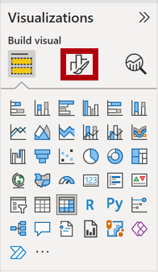
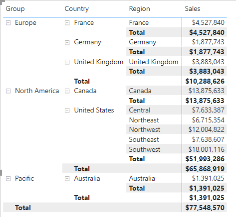
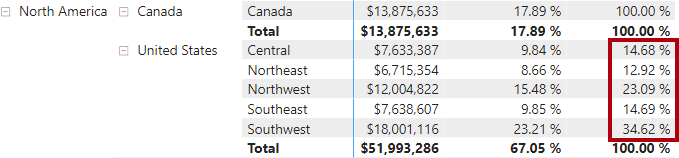
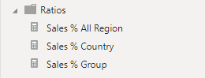

---
lab:
    course: 'PL-300'
    title: 'Create Advanced DAX Calculations in Power BI Desktop'
    module: 'Create Model Calculations using DAX in Power BI'
---


# Create Advanced DAX Calculations in Power BI Desktop

## **Lab story**

In this lab, you'll create measures with DAX expressions involving filter context manipulation.

In this lab you learn how to:

- Use the CALCULATE() function to manipulate filter context
- Use Time Intelligence functions

**This lab should take approximately 45 minutes.**

## **Work with Filter Context**

*Important: If you're continuing on from the previous lab (and you completed that lab successfully), don't complete this task; instead, continue from the next task.*

1. Open Power BI Desktop.

    

    *Tip: By default, the Getting Started dialog box opens in front of Power BI Desktop. You can choose to sign-in, and then close the pop-up.*

1. To open the starter Power BI Desktop file, select the **File > Open Report > Browse Reports**.

1. In the **Open** window, navigate to the **D:\Allfiles\Labs\05-create-dax-calculations-in-power-bi-desktop-advanced\Starter**  folder, and open the **Sales Analysis** file.

1. Close any informational windows that may open.

1. Notice the warning message beneath the ribbon. 

	*This message alerts you to the fact that the queries haven't been applied to load as model tables. You’ll apply the queries later in this lab.*
    
	*To dismiss the warning message, at the right of the warning message, select **X**.*

1. To create a copy of the file, go to **File > Save As** and save to **D:\Allfiles\MySolution** folder.

## **Create a matrix visual**

In this task, you'll create a matrix visual to support testing your new measures.

1. In Power BI Desktop, in Report view, create a new report page.

1. On **Page 3**, add a matrix visual.

    

1. Resize the matrix visual to fill the entire page.

1. To configure the matrix visual fields, from the **Data** pane, drag the **Region \| Regions** hierarchy, and drop it inside the visual.
    
	*The labs use a shorthand notation to reference a field or hierarchy. It will look like this: **Region \| Regions**. In this example, **Region** is the table name and **Regions** is the hierarchy name.*

1. Add also the **Sales \| Sales** field.

1. To expand the entire hierarchy, at the top-right of the matrix visual, select the forked-double arrow icon twice.
    
	*You may recall that the **Regions** hierarchy has the levels **Group**, **Country**, and **Region**.*

    

1. To format the visual, in the **Visualizations** pane, select the **Format** pane.

    

1. In the **Search** box, enter **Stepped**.

1. Set the **Stepped Layout** property to **Off**.

    

1. Verify that the matrix visual now has four column headers.

    

    *At Adventure Works, the sales regions are organized into groups, countries, and regions. All countries—except the United States—have just one region, which is named after the country. As the United States is such a large sales territory, it’s divided into five sales regions.*

    *You’ll create several measures in this exercise, and then test them by adding them to the matrix visual.*

## **Manipulate filter context**

In this task, you'll create several measures with DAX expressions that use the CALCULATE() function to manipulate filter context.

1. Add a measure to the **Sales** table, based on the following expression:
    
	 *For your convenience, all DAX definitions in this lab can be copied from the **D:\Allfiles\Labs\05-create-dax-calculations-in-power-bi-desktop-advanced\Assets\Snippets.txt** file.*


    **DAX**


    ```
    Sales All Region =

    CALCULATE(SUM(Sales[Sales]), REMOVEFILTERS(Region))
    ```


    *The CALCULATE() function is a powerful function used to manipulate the filter context. The first argument takes an expression or a measure (a measure is just a named expression). Subsequent arguments allow modifying the filter context.*

    *The REMOVEFILTERS() function removes active filters. It can take either no arguments, or a table, a column, or multiple columns as its argument.*

    *In this formula, the measure evaluates the sum of the **Sales** column in a modified filter context, which removes any filters applied to the columns of the **Region** table.*

1. Add the **Sales All Region** measure to the matrix visual.

    

1. Notice that the **Sales All Region** measure computes the total of all region sales for each region, country (subtotal) and group (subtotal).

    *The new measure is yet to deliver a useful result. When the sales for a group, country, or region is divided by this value it will produce a useful ratio known as “percent of grand total”.*

1. In the **Data** pane, ensure that the **Sales All Region** measure is selected (when selected, it will have a dark gray background), and then in the formula bar, replace the measure name and formula with the following formula:

    *Tip: To replace the existing formula, first copy the snippet. Then, select inside the formula bar and press **Ctrl+A** to select all text. Then, press **Ctrl+V** to paste the snippet to overwrite the selected text. Then press **Enter**.*


    **DAX**


    ```
    Sales % All Region =  
    DIVIDE(  
     SUM(Sales[Sales]),  
     CALCULATE(  
     SUM(Sales[Sales]),  
     REMOVEFILTERS(Region)  
     )  
    )
    ```

    *The measure has been renamed to accurately reflect the updated formula. The DIVIDE() function divides the **Sales** measure (not modified by filter context) by the **Sales** measure in a modified context, which removes any filters applied to the **Region** table.*

1. In the matrix visual, notice that the measure has been renamed and that a different value now appears for each group, country, and region.

1. Format the **Sales % All Region** measure as a percentage with two decimal places.

1. In the matrix visual, review the **Sales % All Region** measure values.

    

1. Add another measure to the **Sales** table, based on the following expression, and format as a percentage:


    **DAX**

    ```
    Sales % Country =  
    DIVIDE(  
     SUM(Sales[Sales]),  
     CALCULATE(  
     SUM(Sales[Sales]),  
     REMOVEFILTERS(Region[Region])  
     )  
    )
    ```

1. Notice that the **Sales % Country** measure formula differs slightly from the **Sales % All Region** measure formula.

    *The difference is that the denominator modifies the filter context by removing filters on the **Region** column of the **Region** table, not all columns of the **Region** table. It means that any filters applied to the group or country columns are preserved. It will achieve a result that represents the sales as a percentage of country.*

1. Add the **Sales % Country** measure to the matrix visual.

1. Notice that only the United States’ regions produce a value that isn't 100%.
    
	*You may recall that only the United States has multiple regions. All other countries comprise a single region, which explains why they're all 100%.*

    

    

1. To improve the readability of this measure in visual, overwrite the **Sales % Country** measure with this improved formula.


    **DAX**


    ```
    Sales % Country =  
    IF(  
     ISINSCOPE(Region[Region]),  
     DIVIDE(  
     SUM(Sales[Sales]),  
     CALCULATE(  
     SUM(Sales[Sales]),  
     REMOVEFILTERS(Region[Region])  
     )  
     )  
    )
    ```


    *The IF() function uses the ISINSCOPE() function to test whether the region column is the level in a hierarchy of levels. When true, the DIVIDE() function is evaluated. When false, a blank value is returned because the region column isn't in scope.*

1. Notice that the **Sales % Country** measure now only returns a value when a region is in scope.

    

1. Add another measure to the **Sales** table, based on the following expression, and format as a percentage:


    **DAX**


    ```
    Sales % Group =  
    DIVIDE(  
     SUM(Sales[Sales]),  
     CALCULATE(  
     SUM(Sales[Sales]),  
     REMOVEFILTERS(  
     Region[Region],  
     Region[Country]  
     )  
     )  
    )
    ```


    *To achieve sales as a percentage of group, two filters can be applied to effectively remove the filters on two columns.*

1. Add the **Sales % Group** measure to the matrix visual.

1. To improve the readability of this measure in visual, overwrite the **Sales % Group** measure with this improved formula.


    **DAX**


    ```
    Sales % Group =  
    IF(  
     ISINSCOPE(Region[Region])  
     || ISINSCOPE(Region[Country]),  
     DIVIDE(  
     SUM(Sales[Sales]),  
     CALCULATE(  
     SUM(Sales[Sales]),  
     REMOVEFILTERS(  
     Region[Region],  
     Region[Country]  
     )  
     )  
     )  
    )
    ```


1. Notice that the **Sales % Group** measure now only returns a value when a region or country is in scope.

1. In Model view, place the three new measures into a display folder named **Ratios**.

    

1. Save the Power BI Desktop file.

*The measures added to the **Sales** table have modified filter context to achieve hierarchical navigation. Notice that the pattern to achieve the calculation of a subtotal requires removing some columns from the filter context, and to arrive at a grand total, all columns must be removed.*

## **Work with Time Intelligence**

In this exercise, you'll create a sales year-to-date (YTD) measure and sales year-over-year (YoY) growth measure.

## **Create a YTD measure**

In this task, you'll create a sales YTD measure.

1. In Report view, on **Page 2**, notice the matrix visual that displays various measures with years and months grouped on the rows.

2. Add a measure to the **Sales** table, based on the following expression, and formatted to zero decimal places:


    **DAX**


    ```
    Sales YTD =  
    TOTALYTD(SUM(Sales[Sales]), 'Date'[Date], "6-30")
    ```


    *The TOTALYTD() function evaluates an expression—in this case the sum of the **Sales** column—over a given date column. The date column must belong to a date table marked as a date table, as was done in the **Create DAX Calculations in Power BI Desktop** lab.*

    *The function can also take a third optional argument representing the last date of a year. The absence of this date means that December 31 is the last date of the year. For Adventure Works, June in the last month of their year, and so “6-30” is used.*

3. Add the **Sales** field and the **Sales YTD** measure to the matrix visual.

4. Notice the accumulation of sales values within the year.

    

    *The TOTALYTD() function performs filter manipulation, specifically time filter manipulation. For example, to compute YTD sales for September 2017 (the third month of the fiscal year), all filters on the **Date** table are removed and replaced with a new filter of dates commencing at the beginning of the year (July 1, 2017) and extending through to the last date of the in-context date period (September 30, 2017).*

    *Many Time Intelligence functions are available in DAX to support common time filter manipulations.*

## **Create a YoY growth measure**

In this task, you'll create a sales YoY growth measure.

1. Add another measure to the **Sales** table, based on the following expression:


    **DAX**


    ```
    Sales YoY Growth =  
    VAR SalesPriorYear =  
     CALCULATE(  
     SUM(Sales[Sales]),  
     PARALLELPERIOD(  
     'Date'[Date],  
     -12,  
     MONTH  
     )  
     )  
    RETURN  
     SalesPriorYear
    ```


    *The **Sales YoY Growth** measure uses a variable. Variables help you simplify the formula and are more efficient if using the logic multiple times within a formula.*

    *Variables are declared with a unique name, and the measure expression must then be output after the **RETURN** keyword. Unlike some other coding language variables, DAX variables can only be used within the single formula.*

    *The **SalesPriorYear** variable is assigned an expression that calculates the sum of the **Sales** column in a modified context that uses the PARALLELPERIOD() function to shift 12 months back from each date in filter context.*

1. Add the **Sales YoY Growth** measure to the matrix visual.

1. Notice that the new measure returns BLANK for the first 12 months (because there were no sales recorded before fiscal year 2017).

1. Notice that the **Sales YoY Growth** measure value for **2018 Jul** is the **Sales** value for **2017 Jul**.

    

    *Now that the “difficult part” of the formula has been tested, you can overwrite the measure with the final formula that computes the growth result.*

1. To complete the measure, overwrite the **Sales YoY Growth** measure with this formula, formatting it as a percentage with two decimal places:


    **DAX**


    ```
    Sales YoY Growth =  
    VAR SalesPriorYear =  
     CALCULATE(  
     SUM(Sales[Sales]),  
     PARALLELPERIOD(  
     'Date'[Date],  
     -12,  
     MONTH  
     )  
     )  
    RETURN  
     DIVIDE(  
     (SUM(Sales[Sales]) - SalesPriorYear),  
     SalesPriorYear  
     )
    ```


1. In the formula, in the **RETURN** clause, notice that the variable is referenced twice.

1. Verify that the YoY growth for **2018 Jul** is **392.83%**.

    

    *The YoY growth measure identifies almost 400% (or 4x) increase of sales during the same period of the previous year.*

1. In Model view, place the two new measures into a display folder named **Time Intelligence**.

    

### **Finish up**

In this task, you'll complete the lab.

1. To clean up the solution ready for report development, at the bottom-left, right-click the **Page 2** tab, and then select **Delete** page. When prompted to delete the page, select **Delete**.

1. Delete **Page 3** also.

1. On the remaining page, to clear the page, select the table visual, and the press the **Delete** key.

1. Save the Power BI Desktop file.

1. If you intend to start the next lab, leave Power BI Desktop open.

*You’ll create a report based on the data model in the **Design a Report in Power BI Desktop** lab.*
