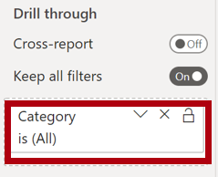
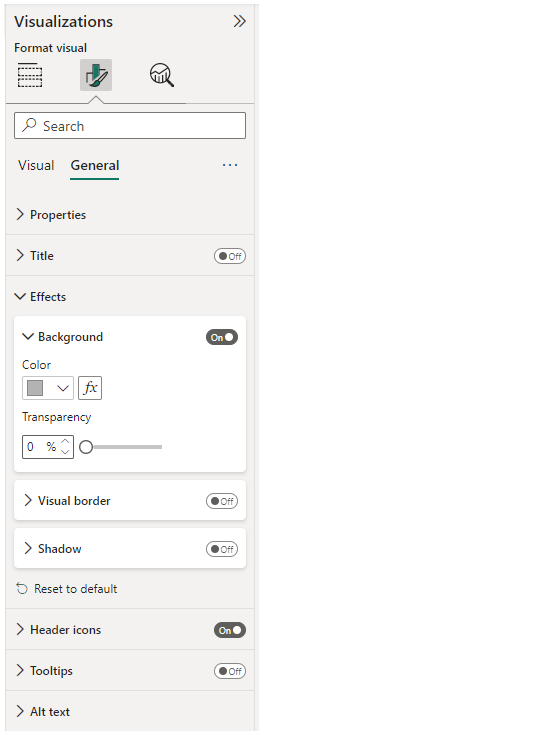
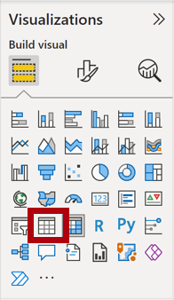
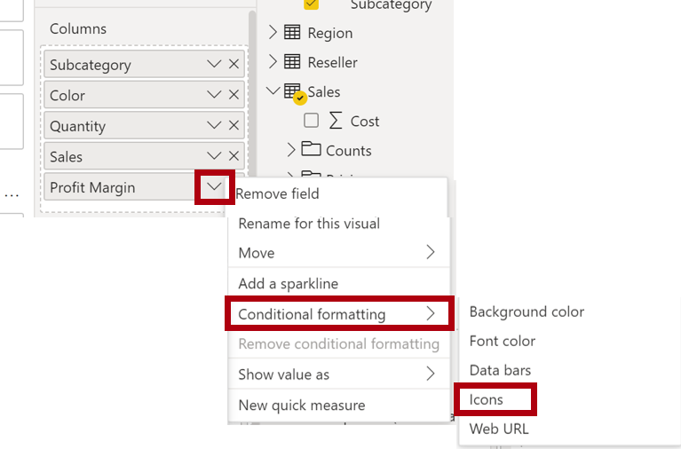
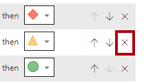
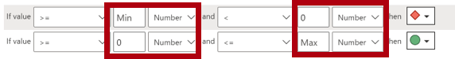
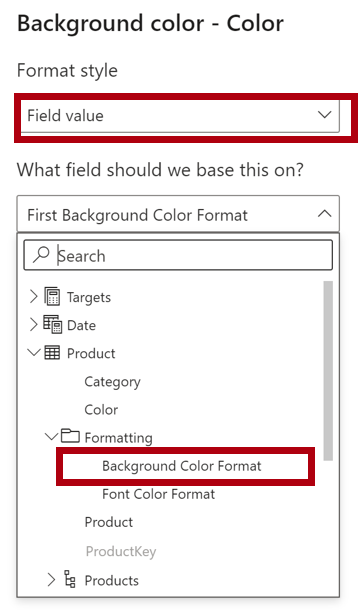
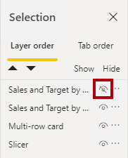
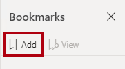
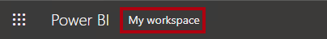

---
lab:
    course: 'PL-300'
    title: 'Enhance a Report in Power BI Desktop'
    module: 'Create Reports in Power BI desktop'
---

# Enhance a Report in Power BI Desktop

## **Lab story**

In this lab, you'll enhance the **Sales Analysis** with advanced design features.

In this lab you learn how to:

- Sync slicers
- Create a drill through page
- Apply conditional formatting
- Create and use bookmarks

**This lab should take approximately 45 minutes.**

## **Get started – Sign in**

In this task, you'll set up the environment for the lab by signing in to Power BI.

*Note: If you've already signed in to Power BI, skip to the next task.*

1. To open Microsoft Edge, on the taskbar, select the Microsoft Edge program shortcut.

     

1. In the Microsoft Edge browser window, navigate to **https://app.powerbi.com**.

    *Tip: You can also use the Power BI Service favorite on the Microsoft Edge favorites bar.*

1. Complete the sign-in process with your organizational credentials (or those provided to you). If prompted by Microsoft Edge to stay signed in, select **Yes**.

1. In the Microsoft Edge browser window, in the Power BI service, in the **Navigation** pane, expand **My Workspace**. Leave the Microsoft Edge browser window open.

     

## **Get started – Open report**

In this task, you'll set up the environment for the lab by opening the starter report.

*Important: If you're continuing on from the previous lab (and you completed that lab successfully), don't complete this task; instead, skip to the next task.*

1. Open Power BI Desktop.

    

    *Tip: By default, the Getting Started dialog box opens in front of Power BI Desktop. You can choose to sign-in, and then close the pop-up.*

1. To open the starter Power BI Desktop file, select the **File > Open Report > Browse Reports**.

1. In the **Open** window, navigate to the **D:\Allfiles\Labs\07-design-report-in-power-bi-desktop-enhanced\Starter** folder, and open the **Sales Analysis** file.

1. Close any informational windows that may open.

1. Notice the warning message beneath the ribbon.

	*This message alerts you to the fact that the queries haven't been applied to load as model tables. You’ll apply the queries later in this lab.*

	*To dismiss the warning message, at the right of the warning message, select **X**.*

1. To create a copy of the file, go to **File > Save As** and save to **D:\Allfiles\MySolution** folder.

1. If prompted to apply changes, select **Apply Later**.

## **Sync slicers**

In this task, you'll sync the **Year** and **Region** slicers, continuing the development of the report created in the **Design a Report in Power BI Desktop** lab.

1. In Power BI Desktop, on the **Overview** page, set the **Year** slicer to **FY2018**.

1. Go to the **My Performance** page, and then notice that the **Year** slicer is a different value.

 	*When slicers aren’t synced, it can contribute to misrepresentation of data and frustration for report users. You’ll now sync the report slicers.*

1. Return to the **Overview** page, and then select the **Year** slicer.

1. On the **View** ribbon tab, from inside the **Show Panes** group, select **Sync Slicers**.

	 

1. In the **Sync Slicers** pane (at the left of the **Visualizations** pane), in the second column (which represents syncing), check the checkboxes for the **Overview** and **My Performance** pages.

	 

1. On the **Overview** page, select the **Region** slicer.

1. Sync the slicer with the **Overview** and **Profit** pages.

	 

1. Test the sync slicers by selecting different filter options, and then verifying that the synced slicers filter by the same selection.

1. To close the **Sync Slicer** page, select the **X** located at the top-right of the pane.

## **Configure drill through**

In this exercise, you'll create a new page and configure it as a drill through page. When you’ve completed the design, the page will look like the following:

## **Create a drill through page**

In this task, you'll create a new page and configure it as a drill through page.

1. Add a new report page named **Product Details**.

1. Right-click the **Product Details** page tab, and then select **Hide Page**.

	*Report users won’t be able to go to the drill through page directly. They’ll need to access it from visuals on other pages. You’ll learn how to drill through to the page in the final exercise of this lab.*

1. Beneath the **Visualizations** pane, in the **Drill Through** section, add the **Product \| Category** field to the **Add Drill-Through Fields Here** box.

	*The labs use a shorthand notation to reference a field. It will look like this: **Product \| Category**. In this example, **Product** is the table name and **Category** is the field name.*

	 

1. To test the drill through page, in the drill through filter card, select **Bikes**.

	 

1. At the top-left of the report page, notice the arrow button.

	*An arrow button is added automatically when a field is added to the drill through well/area. It allows report users to navigate back to the page from which they drilled through.*

1. Add a **Card** visual to the page, and then resize and position it so it sits to the right of the button and fills the remaining width of the page.

	

	

1. Drag the **Product \| Category** field into the card visual.

1. Configure the format options for the visual, and then turn the **Category Label** property to **Off**.

	 

1. Set the **Effects > Background** color property to a light shade of gray such as *White, 20% darker*.

     

1. Add a **Table** visual to the page, and then resize and position it so it sits beneath the card visual and fills the remaining space on the page.

	 

	 

1. Add the following fields to the visual:

	 - Product \| Subcategory
	 - Product \| Color
	 - Sales \| Quantity
	 - Sales \| Sales
	 - Sales \| Profit Margin

1. Configure the format options for the visual, and in the **Values** section, set the **Text Size** property to **20pt**.

*The design of the drill through page is almost complete. You’ll enhance the page with conditional formatting in the next exercise.*

## **Add Conditional Formatting**

In this exercise, you'll enhance the drill through page with conditional formatting. When you’ve completed the design, the page will look like the following:

## **Add conditional formatting**

In this task, you'll enhance the drill through page with conditional formatting.

1. Select the table visual. In the visualization pane, select the down-arrow on the **Profit Margin** value, and then select **Conditional Formatting \| Icons**.

	

1. In the **Icons – Profit Margin** window, in the **Icon Layout** dropdown list, select **Right of Data**.

	 

1. To delete the middle rule, at the right of the yellow triangle, select **X**.

	 

1. Configure the first rule (red diamond) as follows:

    - In the second control, remove the value
    - In the third control, select **Number**
    - In the fifth control, enter **0**
    - In the sixth control, select **Number**

1. Configure the second rule (green circle) as follows, then select **OK**:

	*The rules can be interpreted as follows: display a red diamond if the profit margin value is less than 0; otherwise if the value is great or equal to zero, display a green circle.*

	 - In the second control, enter **0**
	 - In the third control, select **Number**
	 - In the fifth control, remove the value
	 - In the sixth control, select **Number**

	 

1. In the table visual, verify that the correct icons are displayed.

	 

1. Configure background color conditional formatting for the **Color** field.

1. In the **Background Color – Color** window, in the **Format Style** dropdown list, select **Field Value**.

1. In the **What field should we base this on?** dropdown list, select **Product \| Formatting \| Background Color Format**, then **OK**.

	 

1. Repeat the previous steps to configure font color conditional formatting for the **Color** field, using the **Product \| Formatting \| Font Color Format** field

*You may recall that the background and font colors were source from the **ColorFormats.csv** file in the **Prepare Data in Power BI Desktop** lab, and then integrated with the **Product** query in the **Load Data in Power BI Desktop** lab.*

## **Add Bookmarks and Buttons**

In this exercise you'll enhance the **My Performance** page with buttons, allowing the report user to select the visual type to display. When you’ve completed the design, the page will look like the following:

## **Add bookmarks**

In this task you'll add two bookmarks, one to display each of the monthly sales/targets visuals.

1. Go to the **My Performance** page. On the **View** ribbon tab, from inside the **Show Panes** group, select **Bookmarks**.

	 

1. On the **View** ribbon tab, from inside the **Show Panes** group, select **Selection**.

1. In the **Selection** pane, beside one of the **Sales and Target by Month** items, to hide the visual, select the eye icon.

	 

1. In the **Bookmarks** pane, select **Add**.

	*To rename the bookmark, double-click the bookmark.*

	 

1. If the visible chart is the bar chart, rename the bookmark as **Bar Chart ON**, otherwise rename the bookmark as **Column Chart ON**.

1. To edit the bookmark, in the **Bookmarks** pane, hover the cursor over the bookmark, select the ellipsis, and then select **Data**.
	 
	 *Disabling the **Data** option means the bookmark won’t use the current filter state. That’s important because otherwise the bookmark would permanently lock in the filter currently applied by the **Year** slicer.*

     

1. To update the bookmark, select the ellipsis again, and then select **Update**.

	 *In the following steps, you’ll create and configure a second bookmark to show the second visual.*

1. In the **Selection** pane, toggle the visibility of the two **Sales and Target by Month** items.

	 *In other words, make the visible visual hidden, and make the hidden visual visible.*

	 

1. Create a second bookmark, and name it appropriately (either **Column Chart ON** or **Bar Chart ON).**

	 

1. Configure the second bookmark to ignore filters (**Data** option off), and update the bookmark.

1. In the **Selection** pane, to make both visuals visible, simply show the hidden visual.

1. Resize and reposition both visuals so they fill the page beneath the multi-card visual, and completely overlap one another.

	*To select the visual that is covered up, select it in the **Selection** pane.*

	

1. In the **Bookmarks** pane, select each of the bookmarks, and notice that only one of the visuals is visible.

*The next stage of design is to add two buttons to the page, which will allow the report user to select the bookmarks.*

## **Add buttons**

In this task you'll add two buttons, and assign bookmark actions to each.

1. On the **Insert** ribbon, from inside the **Elements** group, select **Button**, and then select **Blank**.

	 

1. Position the button directly beneath the **Year** slicer.

1. Select the button, and then in the **Format button** pane, select **Button**, expand **Style** section and turn the **Text** property to **On**.

	 

1. Expand the **Text** section, and then in the **Text** box, enter **Bar Chart**.

1. Expand the **Fill** section, and then set a fill color using a complementary color.

1. Select **Button** and turn the **Action** property to **On**.

	

1. Expand the **Action** section, and then set the **Type** dropdown list to **Bookmark**.

1. In the **Bookmark** dropdown list, select **Bar Chart ON**.

	

1. Create a copy of the button by using copy and paste, and then configure the new button as follows:

	*Tip: The shortcut commands for copy and paste are **Ctrl+C** followed by **Ctrl+V**.*

	- Set the **Button Text** property to **Column Chart**
	- In the **Action** section, set the **Bookmark** dropdown list to **Column Chart ON**

*The design of the Sales Analysis report is now complete.*

## **Publish the report**

In this task, you'll publish the report.

1. Select the **Overview** page.

1. In the **Year** slicer, select **FY2020**.

1. In the **Region** slicer, select **Select All**.

1. Save the Power BI Desktop file.

	*The file must always be saved prior to publishing to the Power BI service.*

1. On the **Home** ribbon tab, from inside the **Share** group, select **Publish**.

	 

1. In the **Publish to Power** BI window, notice that **My Workspace** is selected.

1. To publish the report, select **Select**.
    1. If prompted to replace the semantic model, select **Replace**.
    1. When the publication has succeeded, select **Got It**.

1. Close Power BI Desktop.

*You’ll explore the report in the Power BI service in the next exercise.*

## **Explore the report**

In this task, you'll explore the report in the Power BI service.

1. In a Microsoft Edge browser window, navigate to the Power BI service > **My Workspace**, then select the **Sales Analysis** report.

1. To test the drill through feature, navigate to **Overview** page > **Quantity by Category** visual. Then right-click the **Clothing** bar and select **Drill Through \| Product Details**.

	 

1. Notice that the **Product Details** page is for **Clothing**.

1. To return to the source page, at the top-left corner of the page, select the arrow button.

1. Select the **My Performance** page.

	*Select each of the buttons, and then notice that a different visual is displayed.*

### **Finish up**

In this task, you'll complete the lab.

To return to your workspace, in the banner across the window web page, select **My Workspace**.

