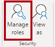
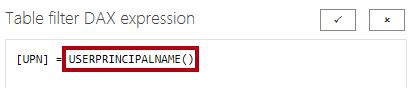
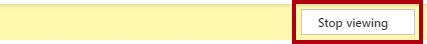

---
lab:
    course: 'PL-300'
    title: 'Enforce Row-Level Security'
    module: 'Enforce Row-Level Security'
---

# **Enforce Row-Level Security**

## **Lab story**

In this lab, you'll enforce row-level security to ensure that a salesperson can only analyze sales data for their assigned region(s).

In this lab you learn how to:

- Enforce row-level security
- Choose between dynamic and static methods

**This lab should take approximately 20 minutes.**

## **Get started**

In this task, you'll set up the environment for the lab.

*Important: If you're continuing on from the previous lab (and you completed that lab successfully), don't complete this task; instead, continue from the next task.*

1. Open Power BI Desktop.

    

    *Tip: By default, the Getting Started dialog box opens in front of Power BI Desktop. **Sign-in** and then close the pop-up.*

1. To open the starter Power BI Desktop file, select the **File > Open Report > Browse Reports**.

1. In the **Open** window, navigate to the **D:\Allfiles\Labs\10-row-level-security\Starter** folder, and open the **Sales Analysis** file.

1. Close any informational windows that may open.

1. Notice the warning message beneath the ribbon. *This message alerts you to the fact that the queries haven't been applied to load as model tables. You’ll apply the queries later in this lab.*
    
	*To dismiss the warning message, at the right of the warning message, select **X**.*

1. To create a copy of the file, go to **File > Save As** and save to **D:\Allfiles\MySolution** folder.

1. If prompted to apply changes, select **Apply Later**.

## **Enforce row-level security**

In this task, you'll enforce row-level security to ensure a salesperson can only see sales made in their assigned region(s).

1. Switch to Data view.

   

1. In the **Data** pane, select the **Salesperson (Performance)** table.

1. Review the data, noticing that Michael Blythe (EmployeeKey 281) has a UPN value of: **michael-blythe@adventureworks.com**
    
	*You may recall that Michael Blythe is assigned to three sales regions: US Northeast, US Central, and US Southeast.*

1. On the **Modeling** ribbon tab, from inside the **Security** group, select **Manage Roles**.

    

1. In the **Manage Roles** window, select **Create**.

1. In the box, replace the selected text with the name of the role: **Salespeople**, and then press **Enter**.

   

1. To assign a filter, for the **Salesperson (Performance)** table, select the ellipsis (…) character, and then select **Add Filter \| [UPN]**.

   

1. In the **Table Filter DAX Expression** box, modify the expression by replacing **“Value”** with **USERPRINCIPALNAME()**, and then **Save**.
    
	*USERPRINCIPALNAME() is a Data Analysis Expressions (DAX) function that returns the name of the authenticated user. It means that the **Salesperson (Performance)** table will filter by the User Principal Name (UPN) of the user querying the model.*

   

1. To test the security role, on the **Modeling** ribbon tab, from inside the **Security** group, select **View As**.

   

1. In the **View as Roles** window, check the **Other User** item, and then in the corresponding box, enter: **michael-blythe@adventureworks.com**

1. Check the **Salespeople** role, and then **OK**.
    
	*This configuration results in using the **Salespeople** role and impersonating the user with your Michael Blythe’s name.*

   

1. Notice the yellow banner above the report page, describing the test security context.

   

1. In the table visual, notice that only the salesperson **Michael Blythe** is listed.

   

1. To stop testing, at the right side of the yellow banner, select **Stop Viewing**.

   

1. To delete the **Salespeople** role, on the **Modeling** ribbon tab, from inside the **Security** group, select **Manage Roles**.

   

1. In the **Manage Roles** window, select **Delete**. When prompted to confirm the deletion, select **Yes, Delete**.

   

### **Finish up**

In this task, you'll complete the lab.

1. Select **Save**, then save the Power BI Desktop file to end the lab.

*Note: When the Power BI Desktop file is published to the Power BI service, you’ll need to complete a post-publication task to map security principals to the **Salespeople** role. You won’t do that in this lab.*
